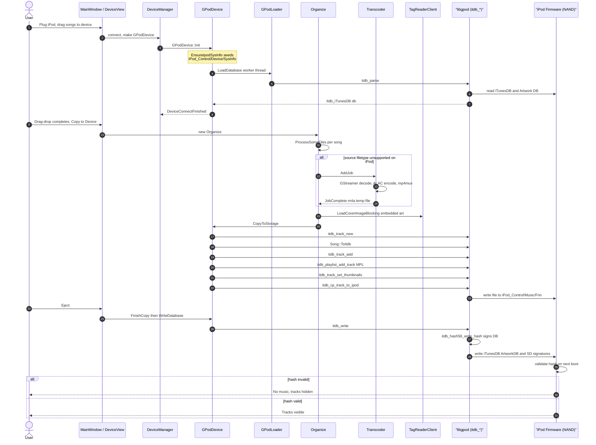

# 10. iPod Sync (Deep Dive)

> Audience: anyone touching `src/device/gpod*.{h,cpp}`, `src/organize/`, `src/transcoder/`,
> or `src/core/song.cpp` `Song::ToItdb()`. iPod sync is the most fragile end-to-end
> path in Strawberry — small omissions cause the iPod to silently reject the
> database. This document captures the *non-obvious* contracts.

---

## 10.1 End-to-End Data Flow



The fragile bits are steps **3** (SysInfo seeding), **15** (`Song::ToItdb` setting `filetype` correctly), and **20** (`itdb_write` actually being able to sign the DB).

---

## 10.2 The libgpod Mental Model

`libgpod` (in [`.idea/strawberry-libgpod/`](../.idea/strawberry-libgpod/) — a git
submodule pinned to Strawberry's fork) abstracts the binary iTunesDB. The shape
to keep in your head:

```
Itdb_iTunesDB
├── Itdb_Device          ← seeded from iPod_Control/Device/SysInfo*
│   ├── FirewireGuid     ← required for hash signing
│   ├── ModelNumStr      ← maps to Itdb_IpodInfo → ipod_generation
│   └── ArtworkCapabilities (looked up by ipod_generation)
├── tracks: GList<Itdb_Track*>
│   ├── ipod_path        ← :-separated, e.g. ":iPod_Control:Music:F00:abcd.m4a"
│   ├── filetype         ← human-readable codec string (see §10.4)
│   ├── type1, type2     ← magic bytes (see §10.4)
│   ├── mediatype = 1    ← Audio
│   ├── has_artwork
│   └── ...
└── playlists: GList<Itdb_Playlist*>
    ├── Master Playlist (MPL)   ← every track MUST also be here
    └── user playlists
```

### Useful libgpod entry points

| `itdb_*` symbol                       | What it does                                                   |
| ------------------------------------- | -------------------------------------------------------------- |
| `itdb_parse(mountpoint, &err)`        | Read iTunesDB → returns `Itdb_iTunesDB*`. Calls `EnsureIpodSysInfo` cousin internally to read `Device/SysInfo*`. |
| `itdb_write(db, &err)`                | Write iTunesDB + sign with hash. Fails silently with zero hash if SysInfo is missing FirewireGuid or ModelNumStr. |
| `itdb_track_new()`                    | Allocate a zeroed `Itdb_Track`.                                |
| `itdb_track_add(db, t, pos)`          | Insert into `db->tracks`. **Does NOT** add to MPL.             |
| `itdb_playlist_mpl(db)`               | Get the master playlist; every track must live here.           |
| `itdb_playlist_add_track(pl, t, pos)` | Adds a track to a playlist.                                    |
| `itdb_cp_track_to_ipod(t, srcpath, &err)` | Physically copies the audio file into `iPod_Control/Music/F##/` and sets `t->ipod_path`. |
| `itdb_track_set_thumbnails(t, jpg)`   | Stashes the JPEG path on the in-memory `Itdb_Track`. **Encoding is deferred** to `itdb_write` time. Returns TRUE on any sane JPEG. NB: a TRUE return does **not** mean the thumbnail will reach the iPod — the real encoding happens later in `ithumb-writer.c`'s `pack_*` functions, which can silently fail (see §10.5 known failure modes). |
| `itdb_device_get_ipod_info(device)`   | Look up the `Itdb_IpodInfo` by `ModelNumStr`. Returns the "Invalid" entry if not found. For `MC297` → `CLASSIC_3` (the lookup strips the leading region letter, so `MC297` → `C297` keys the table). |
| `itdb_device_get_artwork_capabilities(device)` | Returns NULL when `ipod_generation == UNKNOWN`. With a correct `MC297` SysInfo (Bug #3 fix) this returns the Classic-3 `ipod_classic_1_cover_art_info[]` formats — 56×56, 128×128 ×2, 320×320. |
| `itdb_device_get_checksum_type(device)` | Returns `ITDB_CHECKSUM_HASH58`/`HASH72`/`HASHAB`/`NONE` based on generation. |

---

## 10.3 The SysInfo File — Why It's Mandatory

When Apple's iTunes/Music.app first connects to an iPod, it writes
`iPod_Control/Device/SysInfoExtended` (a long XML plist) and
`iPod_Control/Device/SysInfo` (key: value, two-line). libgpod consults these
files on every `itdb_parse`/`itdb_write` to find out:

1. **`FirewireGuid: 0x<16hex>`** — the per-device 64-bit GUID. Used as the
   secret salt for the HMAC over the iTunesDB body. If absent or invalid,
   `itdb_device_get_hex_uuid()` returns FALSE, `itdb_hash58_write_hash()`
   silently writes zeroes into the hash field, and the iPod firmware
   **rejects every track** with no error reported back over USB.
2. **`ModelNumStr: <id>`** (e.g. `MC297` for iPod Classic 7G 160GB Black) —
   indexes into libgpod's static `ipod_info_table` to determine:
   - `ipod_generation` (controls checksum scheme, cover-art sizes).
   - Cover-art format list (sizes & pixel formats supported).
   - Default disk geometry (rarely matters).

### What Strawberry does

`GPodDevice::Init()` calls a static `EnsureIpodSysInfo(mount, unique_id)` (in
[`src/device/gpoddevice.cpp`](../src/device/gpoddevice.cpp)) **before** kicking
off `GPodLoader::LoadDatabase`. It:

- No-ops if `SysInfoExtended` exists (Apple already populated everything).
- No-ops if `SysInfo` exists *and* already contains `FirewireGuid`.
- Otherwise, derives the FirewireGuid from `unique_id` (on macOS the listener
  produces `"USB/<serial>"`, where `<serial>` *is* the FirewireGuid for all
  post-FireWire iPods), and writes:

  ```
  ModelNumStr: MC297
  FirewireGuid: 0x<UPPERCASE_SERIAL>
  ```

#### Why `MC297` specifically?

It's the iPod Classic 7G 160GB Black. We hardcode it because:

- All Classic 6G/7G and Nano 3G/4G use `ITDB_CHECKSUM_HASH58` (matches MC297).
- HASH58 is the *only* checksum scheme libgpod can compute without a host-side
  `HashInfo` file extracted from iTunes/Music.app.
- Newer devices (Nano 5G+, Touch, iPhone, iPad) use `HASH72`/`HASHAB`, which
  *cannot* work without iTunes-side initialization regardless of model string.

The hash is keyed on FirewireGuid + SHA1, **not** on the model, so MC297 is a
correct hash for any HASH58 device even though the displayed model name on the
iPod's settings screen will be wrong.

#### Diagnosing SysInfo problems

```bash
# After plugging in the iPod (mount visible at /Volumes/iPod):
cat /Volumes/iPod/iPod_Control/Device/SysInfo
# Should show ModelNumStr and FirewireGuid lines.

ls -la /Volumes/iPod/iPod_Control/iTunes/iTunesDB
# Size should be > 0; if it's exactly 0 the parse failed.

# Probe the hash header (offset 0x58 = "hash58" field, all zeroes ⇒ unsigned):
hexdump -C /Volumes/iPod/iPod_Control/iTunes/iTunesDB | grep -A1 "^00000058"
```

---

## 10.4 `Song::ToItdb()` — Why `filetype` String Matters

[`src/core/song.cpp`](../src/core/song.cpp) maps Strawberry's `Song` value to
an `Itdb_Track`. The non-obvious requirement: `track->filetype` **must** be a
specific human-readable English string that libgpod's
`itdb_track_set_defaults()` keys off. Without it, the iPod firmware
silently hides the track from the Music menu (the file *is* on disk, the entry
*is* in iTunesDB, but the menu shows "No Songs").

The required strings (case-sensitive, do not localize):

| Strawberry `FileType` | `track->filetype`             | `type1` | `type2` |
| --------------------- | ----------------------------- | ------- | ------- |
| `MPEG` (MP3)          | `"MPEG audio file"`           | `1`     | `1`     |
| `MP4` (AAC)           | `"AAC audio file"`            | `0`     | `0`     |
| `ALAC`                | `"Apple Lossless audio file"` | `0`     | `0`     |
| `WAV`                 | `"WAV audio file"`            | `0`     | `0`     |
| `AIFF`                | `"AIFF audio file"`           | `0`     | `0`     |
| `FLAC`                | `"FLAC audio file"`           | `0`     | `0`     |

`type1`/`type2` are documented in libgpod's `itdb.h` as "0x01 for VBR MP3, 0x00
for AAC". For practical purposes they only matter for MPEG; the rest can stay
zero.

`mediatype = 1` (Audio) is required; without it the track is treated as a
Podcast/Audiobook depending on default flags.

---

## 10.5 The Cover-Art Path

> ✅ As of Bug #4 (the libgpod `(gint)G_MAXUINT` overflow-guard regression
> in `ithumb-writer.c`) being fixed, the cover-art end-to-end **works**
> for FLAC sources with embedded `METADATA_BLOCK_PICTURE` art on an iPod
> Classic Gen-3 (`MC297`). Verified end-to-end against the live device:
> after a sync, `iPod_Control/Artwork/` contains the four expected
> Classic-3 `.ithmb` blobs (`F1055_1.ithmb`, `F1060_1.ithmb`,
> `F1061_1.ithmb`, `F1068_1.ithmb`) plus a populated `ArtworkDB`, and
> covers appear on the iPod's Music → Albums screen.

The chain (in order of execution):

1. `Organize::ProcessSomeFiles` builds a `MusicStorage::CopyJob` and resolves
   the cover in this order:
   - `song.art_manual` (if set, local file exists)
   - `song.art_automatic` (sidecar `cover.jpg`/`folder.jpg` discovered by
     `collectionwatcher`)
   - **For Device destinations only**: embedded art via
     `TagReaderClient::LoadCoverImageBlocking` (reads APIC frame from MP3 /
     `<picture>` block from FLAC).
2. The job is handed to `GPodDevice::CopyToStorage`.
3. If `job.cover_image_` is non-null it's saved to a temp JPEG and passed to
   `itdb_track_set_thumbnails(track, path)`.
4. `itdb_track_set_thumbnails` only **stashes the JPEG path** on
   `track->artwork->thumbnail` (as a `ITDB_THUMB_TYPE_FILE` blob) and sets
   `track->has_artwork = 1`. **No image data is read yet.** Returns TRUE on any
   sane filename — a TRUE return is *not* a signal that the cover will actually
   land on the iPod.
5. On `itdb_write` → `itdb_write_ithumb_files` (in
   `.idea/strawberry-libgpod/src/ithumb-writer.c`):
   - `itdb_device_get_cover_art_formats` is consulted (returns the
     Classic-3 `ipod_classic_1_cover_art_info[]` formats for `MC297`).
   - For each format, the deferred JPEG is re-loaded, decoded via
     `gdk-pixbuf`, scaled to the format's `width`×`height`, and packed
     into the format's pixel layout by one of the `pack_RGB_565` /
     `pack_RGB_555` / `pack_RGB_888` / `pack_I420` / `pack_UYVY`
     functions.
   - Packed pixels are appended to the per-format `F<id>_<n>.ithmb` blob
     file under `iPod_Control/Artwork/`.
   - The `ArtworkDB` index file is then written from the in-memory
     `Itdb_Artwork` structs.

### Known failure modes

- **`Artwork/` directory empty after sync (`.ithmb` files missing, `ArtworkDB`
  is a 3,320-byte empty skeleton)** — was Bug #4, fixed in
  `.idea/strawberry-libgpod/src/ithumb-writer.c`. Every `pack_*` function had
  a broken overflow guard of the form
  `g_return_val_if_fail (dest_width < (gint)G_MAXUINT/2, NULL);`. Because
  `(gint)G_MAXUINT == -1` and `-1/2 == 0`, the predicate `dest_width < 0` was
  always false → every thumbnail encode silently returned `NULL` →
  `ithumb-writer` produced zero `.ithmb` blobs → `ArtworkDB` was written but
  empty. `itdb_write` reported success at the top level because
  `g_return_val_if_fail` swallows the per-thumbnail failure, and audio
  playback was unaffected because hash58 signing is independent of artwork.
  All 10 occurrences of the pattern (across `pack_RGB_565`, `pack_RGB_555`,
  `pack_RGB_888`, `derange_pixels`, `pack_I420`, `pack_UYVY`) were rewritten
  as `(guint)X < G_MAXUINT/...` so the unsigned arithmetic makes sense.
  **Symptom signature:** during `itdb_write` libgpod emits one
  `CRITICAL: pack_*: assertion '... < (gint)G_MAXUINT/...' failed`
  per cover-art format (4× for Classic-3). If you see those criticals come
  back, the patch has regressed — re-check `ithumb-writer.c`.
- **Cover art on the iPod's "Now Playing" screen but not in album list**:
  expected behaviour on Classic/Nano. Album-list art is built from the
  *album*-level artwork blob, which is keyed off `(albumartist, album)`; if
  metadata differs between tracks of the same album the iPod treats them as
  separate albums and each one only gets art from one track.

### Diagnosing a future regression

If `.ithmb` files stop appearing after sync, the fastest reproducer is to
write a ~150-line standalone C probe that links against the same
`libgpod.dylib` Strawberry uses, parses a local FLAC's
`METADATA_BLOCK_PICTURE` directly, calls `itdb_parse` on a *clone* of the
iPod control tree (never the live mount), then `itdb_track_set_thumbnails`
+ `itdb_write`, and `ls`es the sandbox `Artwork/` directory. Any silent
encoding failure shows up as `CRITICAL: pack_*: assertion …` on stderr.
This is how Bug #4 was found — the high-level `set_thumbnails` /
`has_artwork` flags all reported success, so source-level instrumentation
of `Organize.cpp` / `LoadEmbeddedCover` / `CopyToStorage` was a dead end.

### Plumbing reference

| File                                              | Symbol                              | Notes                                                                |
| ------------------------------------------------- | ----------------------------------- | -------------------------------------------------------------------- |
| `src/organize/organize.cpp`                       | `Organize::ProcessSomeFiles`        | The cover-resolution if/else chain (lines ~250–285).                 |
| `src/core/musicstorage.h`                         | `CopyJob::cover_image_`, `cover_source_` | Either a `QImage` or a path on disk. Mutually exclusive — set one. |
| `src/tagreader/tagreaderclient.cpp`               | `LoadCoverImageBlocking`            | Sync wrapper around the out-of-process tag reader.                   |
| `src/tagreader/tagreaderbase.cpp`                 | `LoadEmbeddedCover`                 | Per-format embedded-art extractor (MP3 APIC, FLAC `<picture>`, etc.). |
| `src/device/gpoddevice.cpp`                       | `CopyToStorage`                     | Saves temp JPEG, calls `itdb_track_set_thumbnails`.                  |
| `.idea/strawberry-libgpod/src/itdb_device.c`      | `itdb_device_get_artwork_capabilities` | Picks the per-generation `Itdb_ArtworkFormat[]` from `ipod_artwork_capabilities[]`. Returns NULL only if `ipod_generation == UNKNOWN` (which happens when `ModelNumStr` is missing — see Bug #3). For `MC297` it returns the Classic-3 formats. |
| `.idea/strawberry-libgpod/src/itdb_artwork.c`     | `itdb_artwork_set_thumbnail`        | Stores the JPEG path as a `ITDB_THUMB_TYPE_FILE` thumb. No decode happens here. |
| `.idea/strawberry-libgpod/src/ithumb-writer.c`    | `itdb_write_ithumb_files`, `pack_*` | The **actual encoder**: runs at `itdb_write` time, decodes the deferred JPEG, scales, packs into per-format pixel layout, appends to `F<id>_<n>.ithmb`. Was the site of Bug #4. |

---

## 10.6 Transcoding for iPod (FLAC → ALAC)

iPod Classic cannot play FLAC. Strawberry's `Organize` detects this via
`MusicStorage::GetSupportedFiletypes()` (which `GPodDevice` returns as `MP4,
MPEG, ALAC`) and transcodes on the fly through GStreamer:

```
filesrc → decodebin → audioconvert → audioresample → alacenc → mp4mux → filesink
                                                       ↑
                                                       picked by
                                                       Transcoder::CreateElementForMimeType
```

### The `avenc_alac` vs `avenc_alac_at` problem

On macOS the GStreamer registry contains *two* ALAC encoders:

- `avenc_alac` — the cross-platform FFmpeg implementation (good).
- `avenc_alac_at` — the AudioToolbox-backed shim (bad).

The `_at` variants on macOS **do not propagate EOS through the pipeline**.
Symptom: transcoding progress hits 100% and hangs there forever — `mp4mux`
never finalizes the file, so `FileTranscoded` is never emitted.

`src/transcoder/transcoder.cpp` was patched so `SuitableElement::operator<`
has a tiebreaker preferring non-`_at` encoders when ranks are equal, AND
`CreateElementForMimeType` only demotes libav fallbacks to rank `-1` when a
native (non-libav) candidate exists. That way `avenc_alac` (the only ALAC
encoder on macOS) stays selectable even though libav-class candidates would
normally be deprioritized.

If transcoding hangs at 100%:

```bash
GST_DEBUG=3 /Applications/strawberry.app/Contents/MacOS/strawberry 2>&1 \
  | grep -E "transcoder|alac|mp4mux"
```

You should see `mp4mux` finalize (`pushing eos`, `wrote moov`). If you see
the `_at` encoder being picked, the tiebreaker regressed.

---

## 10.7 Common Failure Modes Quick Reference

> **Before consulting this table:** if the app doesn't launch at all on macOS
> (crashes within ~100 ms, no main window appears), it's almost certainly
> *not* an iPod-sync problem — it's the duplicate-QtCore bundling bug.
> See [`11-macos-dev-loop.md §11.15`](./11-macos-dev-loop.md#1115-post-mortem-the-duplicate-qtcore-crash-read-this-first-if-the-app-wont-launch).
> The failures below all assume the app launches and reaches the device-sync
> code path.

| Symptom                                          | Where to look                                                                  | Likely cause                                                                                       |
| ------------------------------------------------ | ------------------------------------------------------------------------------ | -------------------------------------------------------------------------------------------------- |
| iPod displays "No Music." despite tracks copied  | `iTunesDB` hash field (bytes 0x58–0x68) all zero                              | `SysInfo` missing `FirewireGuid` → no hash signing                                                 |
| iPod shows "0 Songs" but `iPod_Control/Music/` is FULL of .m4a files and `Artwork/` has multi-hundred-MB `.ithmb` blobs | `iTunesDB` is only 16–20 KB on disk (`tracks=0`, just empty MPL) despite thousands of audio files | **Bug #5** — `GPodDevice::FinishCopy(success=false)` skipped `WriteDatabase()` entirely if ANY single file in the sync failed; fixed in `src/device/gpoddevice.cpp` (see §10.8 for deep dive + rescue procedure). |
| Tracks copied but invisible in Music menus       | `Song::ToItdb` sets `filetype = NULL`                                          | Missing filetype string mapping (added in `src/core/song.cpp`)                                     |
| `itdb_track_set_thumbnails` returns FALSE        | `ArtworkCapabilities` lookup failed                                            | `Device/SysInfo` missing `ModelNumStr` (Bug #3 — fixed: `EnsureIpodSysInfo` writes `MC297`)        |
| Tracks synced, audio plays, but `Artwork/` empty (no `.ithmb`, `ArtworkDB` ~3 KB) | `ithumb-writer.c` `pack_*` overflow guards short-circuit to `NULL`              | libgpod Bug #4 — `(gint)G_MAXUINT/N` is `0` (signed-int overflow); fixed in `ithumb-writer.c`. If you see `CRITICAL: pack_*: assertion '… < (gint)G_MAXUINT/…' failed` during `itdb_write`, the patch has regressed. |
| Cover art works in iTunes but not Strawberry     | `Organize.cpp` cover chain                                                     | `art_manual_is_valid` true but path missing — no fall-through (known bug)                          |
| Transcoding stuck at 100%                        | `Transcoder::CreateElementForMimeType` picked `avenc_alac_at`                  | tiebreaker missing / inverted in `SuitableElement::operator<`                                      |
| `itdb_parse` returns NULL                        | `iPod_Control/iTunes/iTunesDB` is corrupt or missing                           | iPod was disconnected mid-write; restore by re-syncing from iTunes or doing a soft reset           |
| Files copied but "Invalid format" on playback    | `track->type1`/`type2` are wrong                                              | Check `Song::ToItdb` table — usually `type1=1, type2=1` for VBR MP3 is the most common miss        |
| Transcoded ALAC files on iPod have no title/artist/album tags (only `track` survives) | `Transcoder` GStreamer pipeline doesn't propagate source tags to mp4mux | **Bug #6 (pending)** — `mp4mux` is being plumbed without a `taginject` / `id3v2mux`-equivalent step. Strawberry's iTunesDB still has the correct tags from `Song::ToItdb`, so user impact is invisible *unless* the iTunesDB is lost (then rescue tools can't recover names from the bare m4a files). |
| "Error copying songs" dialog lists just `04 Time.flac` × N, no album/path | `src/organize/organize.cpp::ProcessSomeFiles` line 332 (pre-fix) used `basefilename()` instead of `url().toLocalFile()` | **Bug #7 (fixed)** — full source path now goes into `files_with_errors_` so the user can tell which album's `04 Time.flac` failed. See §10.10. |
| Bug #5 source fix is in `src/` but iPod still ends up empty after a partial-failure sync | `/Applications/strawberry.app` binary was last built *before* the source fix | You forgot to re-run `./install-macos.sh build && bundle && install`. The fix doesn't ship until the .app is rebuilt. `ls -la /Applications/strawberry.app/Contents/MacOS/strawberry` should show a date *after* your last source edit. |

---

## 10.8 Bug #5: `FinishCopy(false)` Silently Discards the Entire iTunesDB

> **Severity: catastrophic.** A single failed file in a multi-thousand-track
> sync left the user with `iPod_Control/Music/F##/` full of correctly-copied
> `.m4a` files, `iPod_Control/Artwork/` full of multi-hundred-MB `.ithmb`
> blobs, **and** an empty 16 KB `iTunesDB` (0 tracks, 1 empty MPL). The iPod
> firmware browses *only* by iTunesDB, so the device displays "0 Songs"
> while ~150 GB of music sits inert on the flash.

### The bug

```cpp
// src/device/gpoddevice.cpp (BEFORE)
bool GPodDevice::FinishCopy(bool success, QString &error_text) {
  if (success) success = WriteDatabase(error_text);   // ← gated!
  Finish(success);
  return ConnectedDevice::FinishCopy(success, error_text);
}
```

`Organize::ProcessSomeFiles` is the only caller. When *any* per-file copy
fails — bad source, transcoder hang, FLAC decode error, etc. — Organize
collects the failure into `files_with_errors_` and at the end of the run
calls:

```cpp
destination_->FinishCopy(files_with_errors_.isEmpty(), error_text);
```

So `success` here means "every single file copied without error". A single
corrupt FLAC out of 3,520 was enough to flip `success` to `false`, which
skipped `WriteDatabase()` entirely. The 3,489 tracks that *did* copy
successfully — their `Itdb_Track*` had been added to `db_->tracks` and the
MPL in memory by `CopyToStorage`, and `itdb_cp_track_to_ipod` had already
moved the audio bytes onto NAND — were lost the moment `Finish()` unlocked
`db_busy_` and the user disconnected.

`FinishDelete` had the identical bug pattern.

### The fix

```cpp
// src/device/gpoddevice.cpp (AFTER)
bool GPodDevice::FinishCopy(bool success, QString &error_text) {
  const bool write_ok = WriteDatabase(error_text);
  if (!write_ok) success = false;
  Finish(success);
  return ConnectedDevice::FinishCopy(success, error_text);
}
```

`WriteDatabase` is now called unconditionally — the in-memory `db_` already
contains *only* the per-track successes, so writing it is always the right
thing. `success` is then ANDed with the write result so callers still see a
truthful "everything worked" bit.

Same change was applied to `FinishDelete`, plus `Finish()` was relaxed so
the Strawberry-side collection cache (`songs_to_add_` / `songs_to_remove_`)
is updated unconditionally — those lists only ever contain per-track
successes, so it's wrong to drop them on partial failure.

### Detection on a live iPod

```bash
# 1. iTunesDB tiny but Music/ huge ⇒ classic Bug #5 fingerprint.
ls -la /Volumes/iPod/iPod_Control/iTunes/iTunesDB                 # ~16 KB
find /Volumes/iPod/iPod_Control/Music -name '*.m4a' | wc -l       # 3,520
du -sh /Volumes/iPod/iPod_Control/Artwork/                        # > 1 GB

# 2. Compile and run the tiny probe (compiles against the same libgpod
#    submodule, links via DYLD_LIBRARY_PATH so we don't need to install).
LIBGPOD=.idea/strawberry-libgpod
cc .ai/tools/itdb-deep.c -o /tmp/itdb-deep \
   -I"$LIBGPOD/src" -I"$LIBGPOD" -I"$LIBGPOD/build" \
   $(pkg-config --cflags glib-2.0) \
   $(pkg-config --libs glib-2.0 gobject-2.0) \
   "$LIBGPOD/build/libgpod.dylib"
DYLD_LIBRARY_PATH=$LIBGPOD/build /tmp/itdb-deep /Volumes/iPod
# Expect:
#   Tracks: 0
#   Playlists: 1
#   Playlist 0: "<user's iPod name>"
#     is_mpl: 1
#     Members in list: 0
```

If `Tracks: 0` plus a populated `Music/` and `Artwork/`, you're looking at
Bug #5.

### Rescue (already-broken iPod)

[`.ai/tools/itdb-rescue.c`](./tools/itdb-rescue.c) rebuilds the iTunesDB
*and* the cover-art `.ithmb` blobs from disk + Strawberry's collection
cache. Strategy:

1. `itdb_parse` the existing iTunesDB to inherit MPL name + SysInfo. If
   there are already tracks in the DB (e.g. you ran an earlier rescue
   pass), `itdb_path`-keyed dedup makes the tool idempotent — it just
   overwrites the in-memory track fields.
2. `opendir` each `iPod_Control/Music/F##/`, list `*.m4a` / `*.mp3`.
3. For each on-disk file, run `ffprobe` to get
   `duration / bit_rate / sample_rate`.
4. Open `~/Library/Application Support/Strawberry/Strawberry/strawberry.db`
   and `SELECT * FROM songs WHERE source = 2 AND unavailable = 0`
   (`source = 2` is `Song::Source::Collection`).
5. **Match each on-disk file to a collection row by rounded-seconds
   duration** (greedy ±3 s window). On a 3,531-row library matching
   against 3,520 files we hit 3,510/3,520 — the remaining 10 are corrupt
   files `ffprobe` couldn't read; they fall through to a
   `libgpodXXXXXX.m4a` filename-as-title fallback.
6. **Re-attach cover art** by recomputing the SHA1 hash that Strawberry
   uses to name cached device covers
   (`<AppLocalDataLocation>/devicealbumcovers/<sha1>.jpg`, where
   `<sha1> = SHA1(lowercase_albumartist_utf8 + lowercase_album_utf8)`
   from [`src/utilities/coverutils.cpp::Sha1CoverHash`](../src/utilities/coverutils.cpp)),
   looking up the JPEG, and calling `itdb_track_set_thumbnails(t, path)`.
   The `.ithmb` blobs and `ArtworkDB` index are then regenerated by
   `itdb_write`'s call to `itdb_write_ithumb_files` (§10.5). On the live
   recovery run this hit 3,472/3,520 albums (the misses are non-ASCII
   album names — our `tolower` is ASCII-only).
7. `itdb_track_add` + `itdb_playlist_add_track(mpl, …)` for any new
   track, then `itdb_write(db, &err)` — which writes the iTunesDB *and*
   re-signs the hash58 header using the existing `Device/SysInfo`
   FirewireGuid.

Build/run:

```bash
LIBGPOD=.idea/strawberry-libgpod
cc .ai/tools/itdb-rescue.c -o /tmp/itdb-rescue \
   -I"$LIBGPOD/src" -I"$LIBGPOD" -I"$LIBGPOD/build" \
   $(pkg-config --cflags glib-2.0) \
   $(pkg-config --libs glib-2.0 gobject-2.0) \
   "$LIBGPOD/build/libgpod.dylib" -lsqlite3

# Dry run first (probes everything, builds in memory, prints stats):
DYLD_LIBRARY_PATH=$LIBGPOD/build /tmp/itdb-rescue \
  /Volumes/iPod \
  "$HOME/Library/Application Support/Strawberry/Strawberry/strawberry.db" \
  --dry-run

# Then for real (writes iTunesDB):
DYLD_LIBRARY_PATH=$LIBGPOD/build /tmp/itdb-rescue \
  /Volumes/iPod \
  "$HOME/Library/Application Support/Strawberry/Strawberry/strawberry.db"
```

Expected output (good case, first pass):

```
Parsed DB: 0 existing tracks, MPL="<name>"
Found 3520 audio files; probing durations ...
Probed; 10 failed.
Loaded 3531 collection songs from …/strawberry.db
Matched 3510/3520 files to songs (out of 3531 collection songs).
Build complete: added=3520, reused_existing=0, used_filename_fallback=10, attached_cover=3472, missing_cover=38.
DB now: 3520 tracks, MPL 3520 members.
itdb_write succeeded. iPod should now show 3520 tracks with 3472 album covers.
```

If you re-run the tool against a populated DB (e.g. to re-attach covers
after a previous pass that didn't), the output will report
`reused_existing=3520, added=0` — that's expected and harmless.

Verify with the probe and look at `Artwork/`:

```bash
DYLD_LIBRARY_PATH=$LIBGPOD/build /tmp/itdb-deep /Volumes/iPod
# Tracks: 3520
# Members in list: 3520
ls -la /Volumes/iPod/iPod_Control/iTunes/iTunesDB
# Now several MB; hash58 field at offset 0x58 non-zero ⇒ signed.
ls -la /Volumes/iPod/iPod_Control/Artwork/
# F1055_1.ithmb / F1060_*.ithmb / F1061_1.ithmb / F1068_1.ithmb
# all freshly timestamped; ArtworkDB ~200 KB for a 3,500-track library.
```

If `itdb-deep` no longer emits any `Could not find corresponding track
(dbid: ...) for artwork entry` warnings, the ArtworkDB is in sync with
the iTunesDB track IDs — that's the disk-level signal that the rescue
worked end-to-end.

The CRITICAL warning `itdb_splr_validate: assertion 'at != ITDB_SPLAT_UNKNOWN' failed`
emitted by `itdb_write` is benign — it's complaining about a smart-playlist
field libgpod doesn't recognise; the write completes successfully.

### Files

- `src/device/gpoddevice.cpp` — `FinishCopy`, `FinishDelete`, and `Finish`
  carry inline comments referencing this section.
- [`.ai/tools/itdb-deep.c`](./tools/itdb-deep.c) — diagnostic probe (reads,
  never writes). Use to confirm Bug #5 symptoms before rescuing.
- [`.ai/tools/itdb-rescue.c`](./tools/itdb-rescue.c) — recovery tool
  (reads + ffprobe + sqlite + writes). Builds an iTunesDB from the audio
  files left on the iPod + Strawberry's collection cache. Kept here as
  reference; the persistent fix is in `gpoddevice.cpp`, so this tool is
  only needed for iPods already broken by the pre-fix bug.

### Related: Bug #6 (pending) — Transcoder strips source tags

Discovered while diagnosing Bug #5: the `*.m4a` files Strawberry produces
during FLAC → ALAC transcoding have only `track` and `creation_time`
tags — no `title`, `artist`, `album`, etc. Stripped by the GStreamer
pipeline (`audioconvert → audioresample → alacenc → mp4mux`) which lacks
a tag-injection element.

User-visible impact is normally zero because the iTunesDB carries the
correct tags from `Song::ToItdb` and the iPod browses by iTunesDB, not
by reading file tags. *But* when Bug #5 destroys the iTunesDB, rescue
tools that re-read the m4a files get no useful identification — Bug #5
made Bug #6's blast radius far larger than its severity would suggest.

The fix for Bug #6 will live in `src/transcoder/` and is tracked
separately from Bug #5.

---

## 10.9 Reference: How to Add a New iPod Generation

If a future contributor wants to support a Nano 5G or later (which uses
HASH72), the steps are:

1. Add the model entry to `.idea/strawberry-libgpod/src/ipod-device-table.h`
   (look for `ipod_info_table[]`).
2. Implement HASH72 signing in `itdb_hash72.c` (currently a stub).
3. Update `EnsureIpodSysInfo` in `src/device/gpoddevice.cpp` to choose the
   correct ModelNumStr based on detected `usb_product_id`.
4. Add a CMake build flag if the new hash needs an external library (libxml2
   for SysInfoExtended parsing already pulled in).
5. Smoke-test: connect, observe `itdb_write` succeeds, hash header is
   non-zero, iPod boots without "No music".

---

## 10.10 UX Bug #7: "Error copying songs" Shows Only Basename

> **Severity: moderate.** A *user-visible* bug whose blast radius is
> psychological: after a sync where N files fail, the error dialog lists
> each failure with **just its leaf filename** (e.g. `04 Time.flac`).
> If the user's library contains multiple albums where the same track
> number means a different song — e.g. *The Dark Side of the Moon*
> (studio) and *The Dark Side of the Moon Live at Wembley, London 1974*
> both have `04 Time.flac`, `06 Money.flac`, `07 Us and Them.flac` —
> the user has no way to tell which one failed. They cannot retry the
> sync intelligently because they cannot locate the offender.

### Root cause

`src/organize/organize.cpp::ProcessSomeFiles` collects per-file failures
into `files_with_errors_`. Three call sites populate this list:

| Line (before fix) | Source of identifier                                 | Granularity         |
| ----------------- | ---------------------------------------------------- | ------------------- |
| 137               | `task.song_info_.song_.url().toLocalFile()`           | **Full path** ✅     |
| 332               | `task.song_info_.song_.basefilename()`                | **Basename only** ❌ |
| 440               | `input` (already a full path from Transcoder::AddJob) | **Full path** ✅     |

Line 332 is the dominant failure path — it fires whenever
`destination_->CopyToStorage(job, error_text)` returns false, which is
basically every per-track failure during normal iPod use (transcoder
choked, encoder produced unreadable file, libgpod `itdb_cp_track_to_ipod`
failed, etc.). The other two paths fire only in unusual setups
(`StartCopy` failed, transcode job failed before the copy step).

The dialog (`src/organize/organizeerrordialog.cpp`) just displays the
strings verbatim, so the *full* path needs to be in the list when it's
collected.

### Fix

```cpp
// src/organize/organize.cpp (AFTER)
else {
  // Report the full source path (not just basefilename) so the user can
  // tell which "04 Time.flac" failed when their library contains multiple
  // albums with the same filename pattern (e.g. live + studio versions
  // of the same album). See `.ai/10-ipod-sync.md` §10.10 "UX bug #7".
  const QString full_path = task.song_info_.song_.url().toLocalFile();
  files_with_errors_ << (full_path.isEmpty() ? task.song_info_.song_.basefilename() : full_path);
  if (!error_text.isEmpty()) {
    log_ << error_text;
  }
}
```

The `isEmpty()` guard preserves the original behaviour for the (unlikely)
case where the song's URL is somehow not a local file — e.g. a remote
Subsonic source that's been pre-staged. In practice this only affects
device-copy operations where the source is always local.

### Why this matters in combination with Bug #5

Pre-Bug #5 fix: 11 corrupt FLACs out of 3,520 caused **all 3,520** to be
silently discarded from the iTunesDB. The user couldn't even tell that
11 had failed — the dialog said "11 errors" but the iPod just said
"0 Songs", so they didn't connect the two.

Post-Bug #5 fix: the same 11 failures now leave 3,509 tracks correctly
visible on the iPod. **But** the user still needs to know which 11 to
retry, and the dialog showing `04 Time.flac` × N is useless for retry
because they can't open Finder to "the one that failed" — they have no
path. Bug #7's fix completes the recovery loop.

### Related: silent failure to *rebuild* the app after source fixes

Two-day saga summary: the Bug #5 source fix was committed to
`src/device/gpoddevice.cpp` on June 29 at ~00:15, but the user did not
re-run `./install-macos.sh build && bundle && install`, so
`/Applications/strawberry.app` continued running the pre-fix binary
(timestamp `Jun 27 20:16`) for ~24 hours. Every subsequent test sync
re-triggered Bug #5 and the user thought the fix didn't work. **The
rebuild step is not optional.** `./install-macos.sh all` will do
build + bundle + install in one shot — recommend running it after
*any* source change, not just architectural ones.

The fix above was committed in the same rebuild on June 30 at ~01:09,
which is the first build that contains BOTH the Bug #5 fix *and* the
Bug #7 fix.

---

## 10.11 Further Reading

- [`docs/iPod-copy-flow.md`](../docs/iPod-copy-flow.md) — earlier scratch notes on the
  copy flow (kept for historical context).
- libgpod source: [`.idea/strawberry-libgpod/`](../.idea/strawberry-libgpod/) —
  particularly `itdb_device.c`, `itdb_itunesdb.c`, `itdb_artwork.c`,
  `ithumb-writer.c` (the artwork encoder — see §10.5 Bug #4),
  `ipod-device-table.h`, `itdb_hash58.c`.
- Apple's never-published format docs reverse-engineered by the iPodLinux /
  gtkpod / libgpod communities.
