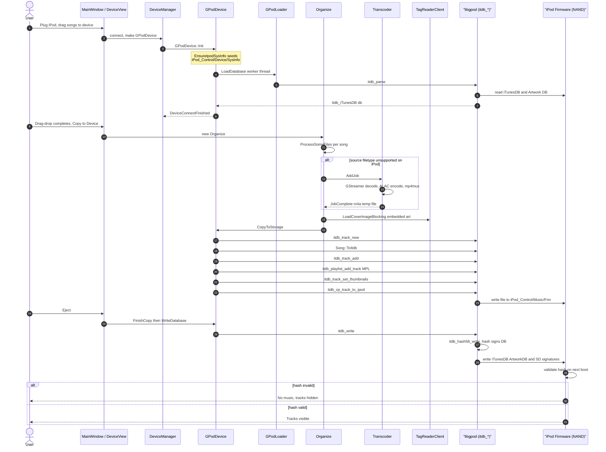

# 10. iPod Sync (Deep Dive)

> Audience: anyone touching `src/device/gpod*.{h,cpp}`, `src/organize/`, `src/transcoder/`,
> or `src/core/song.cpp` `Song::ToItdb()`. iPod sync is the most fragile end-to-end
> path in Strawberry — small omissions cause the iPod to silently reject the
> database. This document captures the *non-obvious* contracts.

---

## 10.1 End-to-End Data Flow



The fragile bits are steps **3** (SysInfo seeding), **15** (`Song::ToItdb` setting `filetype` correctly), and **20** (`itdb_write` actually being able to sign the DB).

---

## 10.2 The libgpod Mental Model

`libgpod` (in [`.idea/strawberry-libgpod/`](../.idea/strawberry-libgpod/) — a git
submodule pinned to Strawberry's fork) abstracts the binary iTunesDB. The shape
to keep in your head:

```
Itdb_iTunesDB
├── Itdb_Device          ← seeded from iPod_Control/Device/SysInfo*
│   ├── FirewireGuid     ← required for hash signing
│   ├── ModelNumStr      ← maps to Itdb_IpodInfo → ipod_generation
│   └── ArtworkCapabilities (looked up by ipod_generation)
├── tracks: GList<Itdb_Track*>
│   ├── ipod_path        ← :-separated, e.g. ":iPod_Control:Music:F00:abcd.m4a"
│   ├── filetype         ← human-readable codec string (see §10.4)
│   ├── type1, type2     ← magic bytes (see §10.4)
│   ├── mediatype = 1    ← Audio
│   ├── has_artwork
│   └── ...
└── playlists: GList<Itdb_Playlist*>
    ├── Master Playlist (MPL)   ← every track MUST also be here
    └── user playlists
```

### Useful libgpod entry points

| `itdb_*` symbol                       | What it does                                                   |
| ------------------------------------- | -------------------------------------------------------------- |
| `itdb_parse(mountpoint, &err)`        | Read iTunesDB → returns `Itdb_iTunesDB*`. Calls `EnsureIpodSysInfo` cousin internally to read `Device/SysInfo*`. |
| `itdb_write(db, &err)`                | Write iTunesDB + sign with hash. Fails silently with zero hash if SysInfo is missing FirewireGuid or ModelNumStr. |
| `itdb_track_new()`                    | Allocate a zeroed `Itdb_Track`.                                |
| `itdb_track_add(db, t, pos)`          | Insert into `db->tracks`. **Does NOT** add to MPL.             |
| `itdb_playlist_mpl(db)`               | Get the master playlist; every track must live here.           |
| `itdb_playlist_add_track(pl, t, pos)` | Adds a track to a playlist.                                    |
| `itdb_cp_track_to_ipod(t, srcpath, &err)` | Physically copies the audio file into `iPod_Control/Music/F##/` and sets `t->ipod_path`. |
| `itdb_track_set_thumbnails(t, jpg)`   | Stashes the JPEG path on the in-memory `Itdb_Track`. **Encoding is deferred** to `itdb_write` time. Returns TRUE on any sane JPEG. NB: a TRUE return does **not** mean the thumbnail will reach the iPod — the real encoding happens later in `ithumb-writer.c`'s `pack_*` functions, which can silently fail (see §10.5 known failure modes). |
| `itdb_device_get_ipod_info(device)`   | Look up the `Itdb_IpodInfo` by `ModelNumStr`. Returns the "Invalid" entry if not found. For `MC297` → `CLASSIC_3` (the lookup strips the leading region letter, so `MC297` → `C297` keys the table). |
| `itdb_device_get_artwork_capabilities(device)` | Returns NULL when `ipod_generation == UNKNOWN`. With a correct `MC297` SysInfo (Bug #3 fix) this returns the Classic-3 `ipod_classic_1_cover_art_info[]` formats — 56×56, 128×128 ×2, 320×320. |
| `itdb_device_get_checksum_type(device)` | Returns `ITDB_CHECKSUM_HASH58`/`HASH72`/`HASHAB`/`NONE` based on generation. |

---

## 10.3 The SysInfo File — Why It's Mandatory

When Apple's iTunes/Music.app first connects to an iPod, it writes
`iPod_Control/Device/SysInfoExtended` (a long XML plist) and
`iPod_Control/Device/SysInfo` (key: value, two-line). libgpod consults these
files on every `itdb_parse`/`itdb_write` to find out:

1. **`FirewireGuid: 0x<16hex>`** — the per-device 64-bit GUID. Used as the
   secret salt for the HMAC over the iTunesDB body. If absent or invalid,
   `itdb_device_get_hex_uuid()` returns FALSE, `itdb_hash58_write_hash()`
   silently writes zeroes into the hash field, and the iPod firmware
   **rejects every track** with no error reported back over USB.
2. **`ModelNumStr: <id>`** (e.g. `MC297` for iPod Classic 7G 160GB Black) —
   indexes into libgpod's static `ipod_info_table` to determine:
   - `ipod_generation` (controls checksum scheme, cover-art sizes).
   - Cover-art format list (sizes & pixel formats supported).
   - Default disk geometry (rarely matters).

### What Strawberry does

`GPodDevice::Init()` calls a static `EnsureIpodSysInfo(mount, unique_id)` (in
[`src/device/gpoddevice.cpp`](../src/device/gpoddevice.cpp)) **before** kicking
off `GPodLoader::LoadDatabase`. It:

- No-ops if `SysInfoExtended` exists (Apple already populated everything).
- No-ops if `SysInfo` exists *and* already contains `FirewireGuid`.
- Otherwise, derives the FirewireGuid from `unique_id` (on macOS the listener
  produces `"USB/<serial>"`, where `<serial>` *is* the FirewireGuid for all
  post-FireWire iPods), and writes:

  ```
  ModelNumStr: MC297
  FirewireGuid: 0x<UPPERCASE_SERIAL>
  ```

#### Why `MC297` specifically?

It's the iPod Classic 7G 160GB Black. We hardcode it because:

- All Classic 6G/7G and Nano 3G/4G use `ITDB_CHECKSUM_HASH58` (matches MC297).
- HASH58 is the *only* checksum scheme libgpod can compute without a host-side
  `HashInfo` file extracted from iTunes/Music.app.
- Newer devices (Nano 5G+, Touch, iPhone, iPad) use `HASH72`/`HASHAB`, which
  *cannot* work without iTunes-side initialization regardless of model string.

The hash is keyed on FirewireGuid + SHA1, **not** on the model, so MC297 is a
correct hash for any HASH58 device even though the displayed model name on the
iPod's settings screen will be wrong.

#### Diagnosing SysInfo problems

```bash
# After plugging in the iPod (mount visible at /Volumes/iPod):
cat /Volumes/iPod/iPod_Control/Device/SysInfo
# Should show ModelNumStr and FirewireGuid lines.

ls -la /Volumes/iPod/iPod_Control/iTunes/iTunesDB
# Size should be > 0; if it's exactly 0 the parse failed.

# Probe the hash header (offset 0x58 = "hash58" field, all zeroes ⇒ unsigned):
hexdump -C /Volumes/iPod/iPod_Control/iTunes/iTunesDB | grep -A1 "^00000058"
```

---

## 10.4 `Song::ToItdb()` — Why `filetype` String Matters

[`src/core/song.cpp`](../src/core/song.cpp) maps Strawberry's `Song` value to
an `Itdb_Track`. The non-obvious requirement: `track->filetype` **must** be a
specific human-readable English string that libgpod's
`itdb_track_set_defaults()` keys off. Without it, the iPod firmware
silently hides the track from the Music menu (the file *is* on disk, the entry
*is* in iTunesDB, but the menu shows "No Songs").

The required strings (case-sensitive, do not localize):

| Strawberry `FileType` | `track->filetype`             | `type1` | `type2` |
| --------------------- | ----------------------------- | ------- | ------- |
| `MPEG` (MP3)          | `"MPEG audio file"`           | `1`     | `1`     |
| `MP4` (AAC)           | `"AAC audio file"`            | `0`     | `0`     |
| `ALAC`                | `"Apple Lossless audio file"` | `0`     | `0`     |
| `WAV`                 | `"WAV audio file"`            | `0`     | `0`     |
| `AIFF`                | `"AIFF audio file"`           | `0`     | `0`     |
| `FLAC`                | `"FLAC audio file"`           | `0`     | `0`     |

`type1`/`type2` are documented in libgpod's `itdb.h` as "0x01 for VBR MP3, 0x00
for AAC". For practical purposes they only matter for MPEG; the rest can stay
zero.

`mediatype = 1` (Audio) is required; without it the track is treated as a
Podcast/Audiobook depending on default flags.

---

## 10.5 The Cover-Art Path

> ✅ As of Bug #4 (the libgpod `(gint)G_MAXUINT` overflow-guard regression
> in `ithumb-writer.c`) being fixed, the cover-art end-to-end **works**
> for FLAC sources with embedded `METADATA_BLOCK_PICTURE` art on an iPod
> Classic Gen-3 (`MC297`). Verified end-to-end against the live device:
> after a sync, `iPod_Control/Artwork/` contains the four expected
> Classic-3 `.ithmb` blobs (`F1055_1.ithmb`, `F1060_1.ithmb`,
> `F1061_1.ithmb`, `F1068_1.ithmb`) plus a populated `ArtworkDB`, and
> covers appear on the iPod's Music → Albums screen.

The chain (in order of execution):

1. `Organize::ProcessSomeFiles` builds a `MusicStorage::CopyJob` and resolves
   the cover in this order:
   - `song.art_manual` (if set, local file exists)
   - `song.art_automatic` (sidecar `cover.jpg`/`folder.jpg` discovered by
     `collectionwatcher`)
   - **For Device destinations only**: embedded art via
     `TagReaderClient::LoadCoverImageBlocking` (reads APIC frame from MP3 /
     `<picture>` block from FLAC).
2. The job is handed to `GPodDevice::CopyToStorage`.
3. If `job.cover_image_` is non-null it's saved to a temp JPEG and passed to
   `itdb_track_set_thumbnails(track, path)`.
4. `itdb_track_set_thumbnails` only **stashes the JPEG path** on
   `track->artwork->thumbnail` (as a `ITDB_THUMB_TYPE_FILE` blob) and sets
   `track->has_artwork = 1`. **No image data is read yet.** Returns TRUE on any
   sane filename — a TRUE return is *not* a signal that the cover will actually
   land on the iPod.
5. On `itdb_write` → `itdb_write_ithumb_files` (in
   `.idea/strawberry-libgpod/src/ithumb-writer.c`):
   - `itdb_device_get_cover_art_formats` is consulted (returns the
     Classic-3 `ipod_classic_1_cover_art_info[]` formats for `MC297`).
   - For each format, the deferred JPEG is re-loaded, decoded via
     `gdk-pixbuf`, scaled to the format's `width`×`height`, and packed
     into the format's pixel layout by one of the `pack_RGB_565` /
     `pack_RGB_555` / `pack_RGB_888` / `pack_I420` / `pack_UYVY`
     functions.
   - Packed pixels are appended to the per-format `F<id>_<n>.ithmb` blob
     file under `iPod_Control/Artwork/`.
   - The `ArtworkDB` index file is then written from the in-memory
     `Itdb_Artwork` structs.

### Known failure modes

- **`Artwork/` directory empty after sync (`.ithmb` files missing, `ArtworkDB`
  is a 3,320-byte empty skeleton)** — was Bug #4, fixed in
  `.idea/strawberry-libgpod/src/ithumb-writer.c`. Every `pack_*` function had
  a broken overflow guard of the form
  `g_return_val_if_fail (dest_width < (gint)G_MAXUINT/2, NULL);`. Because
  `(gint)G_MAXUINT == -1` and `-1/2 == 0`, the predicate `dest_width < 0` was
  always false → every thumbnail encode silently returned `NULL` →
  `ithumb-writer` produced zero `.ithmb` blobs → `ArtworkDB` was written but
  empty. `itdb_write` reported success at the top level because
  `g_return_val_if_fail` swallows the per-thumbnail failure, and audio
  playback was unaffected because hash58 signing is independent of artwork.
  All 10 occurrences of the pattern (across `pack_RGB_565`, `pack_RGB_555`,
  `pack_RGB_888`, `derange_pixels`, `pack_I420`, `pack_UYVY`) were rewritten
  as `(guint)X < G_MAXUINT/...` so the unsigned arithmetic makes sense.
  **Symptom signature:** during `itdb_write` libgpod emits one
  `CRITICAL: pack_*: assertion '... < (gint)G_MAXUINT/...' failed`
  per cover-art format (4× for Classic-3). If you see those criticals come
  back, the patch has regressed — re-check `ithumb-writer.c`.
- **Cover art on the iPod's "Now Playing" screen but not in album list**:
  expected behaviour on Classic/Nano. Album-list art is built from the
  *album*-level artwork blob, which is keyed off `(albumartist, album)`; if
  metadata differs between tracks of the same album the iPod treats them as
  separate albums and each one only gets art from one track.

### Diagnosing a future regression

If `.ithmb` files stop appearing after sync, the fastest reproducer is to
write a ~150-line standalone C probe that links against the same
`libgpod.dylib` Strawberry uses, parses a local FLAC's
`METADATA_BLOCK_PICTURE` directly, calls `itdb_parse` on a *clone* of the
iPod control tree (never the live mount), then `itdb_track_set_thumbnails`
+ `itdb_write`, and `ls`es the sandbox `Artwork/` directory. Any silent
encoding failure shows up as `CRITICAL: pack_*: assertion …` on stderr.
This is how Bug #4 was found — the high-level `set_thumbnails` /
`has_artwork` flags all reported success, so source-level instrumentation
of `Organize.cpp` / `LoadEmbeddedCover` / `CopyToStorage` was a dead end.

### Plumbing reference

| File                                              | Symbol                              | Notes                                                                |
| ------------------------------------------------- | ----------------------------------- | -------------------------------------------------------------------- |
| `src/organize/organize.cpp`                       | `Organize::ProcessSomeFiles`        | The cover-resolution if/else chain (lines ~250–285).                 |
| `src/core/musicstorage.h`                         | `CopyJob::cover_image_`, `cover_source_` | Either a `QImage` or a path on disk. Mutually exclusive — set one. |
| `src/tagreader/tagreaderclient.cpp`               | `LoadCoverImageBlocking`            | Sync wrapper around the out-of-process tag reader.                   |
| `src/tagreader/tagreaderbase.cpp`                 | `LoadEmbeddedCover`                 | Per-format embedded-art extractor (MP3 APIC, FLAC `<picture>`, etc.). |
| `src/device/gpoddevice.cpp`                       | `CopyToStorage`                     | Saves temp JPEG, calls `itdb_track_set_thumbnails`.                  |
| `.idea/strawberry-libgpod/src/itdb_device.c`      | `itdb_device_get_artwork_capabilities` | Picks the per-generation `Itdb_ArtworkFormat[]` from `ipod_artwork_capabilities[]`. Returns NULL only if `ipod_generation == UNKNOWN` (which happens when `ModelNumStr` is missing — see Bug #3). For `MC297` it returns the Classic-3 formats. |
| `.idea/strawberry-libgpod/src/itdb_artwork.c`     | `itdb_artwork_set_thumbnail`        | Stores the JPEG path as a `ITDB_THUMB_TYPE_FILE` thumb. No decode happens here. |
| `.idea/strawberry-libgpod/src/ithumb-writer.c`    | `itdb_write_ithumb_files`, `pack_*` | The **actual encoder**: runs at `itdb_write` time, decodes the deferred JPEG, scales, packs into per-format pixel layout, appends to `F<id>_<n>.ithmb`. Was the site of Bug #4. |

---

## 10.6 Transcoding for iPod (FLAC → ALAC)

iPod Classic cannot play FLAC. Strawberry's `Organize` detects this via
`MusicStorage::GetSupportedFiletypes()` (which `GPodDevice` returns as `MP4,
MPEG, ALAC`) and transcodes on the fly through GStreamer:

```
filesrc → decodebin → audioconvert → audioresample → alacenc → mp4mux → filesink
                                                       ↑
                                                       picked by
                                                       Transcoder::CreateElementForMimeType
```

### The `avenc_alac` vs `avenc_alac_at` problem

On macOS the GStreamer registry contains *two* ALAC encoders:

- `avenc_alac` — the cross-platform FFmpeg implementation (good).
- `avenc_alac_at` — the AudioToolbox-backed shim (bad).

The `_at` variants on macOS **do not propagate EOS through the pipeline**.
Symptom: transcoding progress hits 100% and hangs there forever — `mp4mux`
never finalizes the file, so `FileTranscoded` is never emitted.

`src/transcoder/transcoder.cpp` was patched so `SuitableElement::operator<`
has a tiebreaker preferring non-`_at` encoders when ranks are equal, AND
`CreateElementForMimeType` only demotes libav fallbacks to rank `-1` when a
native (non-libav) candidate exists. That way `avenc_alac` (the only ALAC
encoder on macOS) stays selectable even though libav-class candidates would
normally be deprioritized.

If transcoding hangs at 100%:

```bash
GST_DEBUG=3 /Applications/strawberry.app/Contents/MacOS/strawberry 2>&1 \
  | grep -E "transcoder|alac|mp4mux"
```

You should see `mp4mux` finalize (`pushing eos`, `wrote moov`). If you see
the `_at` encoder being picked, the tiebreaker regressed.

---

## 10.7 Common Failure Modes Quick Reference

> **Before consulting this table:** if the app doesn't launch at all on macOS
> (crashes within ~100 ms, no main window appears), it's almost certainly
> *not* an iPod-sync problem — it's the duplicate-QtCore bundling bug.
> See [`11-macos-dev-loop.md §11.15`](./11-macos-dev-loop.md#1115-post-mortem-the-duplicate-qtcore-crash-read-this-first-if-the-app-wont-launch).
> The failures below all assume the app launches and reaches the device-sync
> code path.

| Symptom                                          | Where to look                                                                  | Likely cause                                                                                       |
| ------------------------------------------------ | ------------------------------------------------------------------------------ | -------------------------------------------------------------------------------------------------- |
| iPod displays "No Music." despite tracks copied  | `iTunesDB` hash field (bytes 0x58–0x68) all zero                              | `SysInfo` missing `FirewireGuid` → no hash signing                                                 |
| iPod shows "0 Songs" but `iPod_Control/Music/` is FULL of .m4a files and `Artwork/` has multi-hundred-MB `.ithmb` blobs | `iTunesDB` is only 16–20 KB on disk (`tracks=0`, just empty MPL) despite thousands of audio files | **Bug #5** — `GPodDevice::FinishCopy(success=false)` skipped `WriteDatabase()` entirely if ANY single file in the sync failed; fixed in `src/device/gpoddevice.cpp` (see §10.8 for deep dive + rescue procedure). |
| Tracks copied but invisible in Music menus       | `Song::ToItdb` sets `filetype = NULL`                                          | Missing filetype string mapping (added in `src/core/song.cpp`)                                     |
| `itdb_track_set_thumbnails` returns FALSE        | `ArtworkCapabilities` lookup failed                                            | `Device/SysInfo` missing `ModelNumStr` (Bug #3 — fixed: `EnsureIpodSysInfo` writes `MC297`)        |
| Tracks synced, audio plays, but `Artwork/` empty (no `.ithmb`, `ArtworkDB` ~3 KB) | `ithumb-writer.c` `pack_*` overflow guards short-circuit to `NULL`              | libgpod Bug #4 — `(gint)G_MAXUINT/N` is `0` (signed-int overflow); fixed in `ithumb-writer.c`. If you see `CRITICAL: pack_*: assertion '… < (gint)G_MAXUINT/…' failed` during `itdb_write`, the patch has regressed. |
| Cover art works in iTunes but not Strawberry     | `Organize.cpp` cover chain                                                     | `art_manual_is_valid` true but path missing — no fall-through (known bug)                          |
| Transcoding stuck at 100%                        | `Transcoder::CreateElementForMimeType` picked `avenc_alac_at`                  | tiebreaker missing / inverted in `SuitableElement::operator<`                                      |
| `itdb_parse` returns NULL                        | `iPod_Control/iTunes/iTunesDB` is corrupt or missing                           | iPod was disconnected mid-write; restore by re-syncing from iTunes or doing a soft reset           |
| Files copied but "Invalid format" on playback    | `track->type1`/`type2` are wrong                                              | Check `Song::ToItdb` table — usually `type1=1, type2=1` for VBR MP3 is the most common miss        |
| Transcoded ALAC files on iPod have no title/artist/album tags (only `track` survives) | `Transcoder` GStreamer pipeline doesn't propagate source tags to mp4mux | **Bug #6 (pending)** — `mp4mux` is being plumbed without a `taginject` / `id3v2mux`-equivalent step. Strawberry's iTunesDB still has the correct tags from `Song::ToItdb`, so user impact is invisible *unless* the iTunesDB is lost (then rescue tools can't recover names from the bare m4a files). |
| "Error copying songs" dialog lists just `04 Time.flac` × N, no album/path | `src/organize/organize.cpp::ProcessSomeFiles` line 332 (pre-fix) used `basefilename()` instead of `url().toLocalFile()` | **Bug #7 (fixed)** — full source path now goes into `files_with_errors_` so the user can tell which album's `04 Time.flac` failed. See §10.10. |
| Bug #5 source fix is in `src/` but iPod still ends up empty after a partial-failure sync | `/Applications/strawberry.app` binary was last built *before* the source fix | You forgot to re-run `./install-macos.sh build && bundle && install`. The fix doesn't ship until the .app is rebuilt. `ls -la /Applications/strawberry.app/Contents/MacOS/strawberry` should show a date *after* your last source edit. |
| Strawberry SIGSEGVs mid-sync (commonly around song ~1,888 on a ~3,500-track first sync) with stack `write_mhsd_playlists` ← `itdb_write_file_internal` ← `itdb_write` ← `GPodDevice::WriteDatabase` ← `Organize::ProcessSomeFiles`, and the macOS .ips report's `ktriageinfo` shows `mach_vm_allocate_kernel failed` (VM exhaustion) | `GPodDevice::CommitCopy` was calling `WriteDatabase` (full `itdb_write`) after EVERY song. Each `itdb_write` re-serialises the whole iTunesDB AND re-walks every existing `.ithmb` slot via `ithmb_rearrange_existing_thumbnails` (which does in-place lseek/read/write/truncate). Doing that 1,888 times in a row exhausts virtual memory and corrupts libgpod's internal pointers. | **Bug #8 (fixed)** — CommitCopy is now throttled to once per `kCommitEvery` (50) songs OR `kCommitIntervalMs` (30 s) wall-clock, whichever fires first; FinishCopy still flushes unconditionally at end of batch. See §10.12. The .ips lives at `~/Library/Logs/DiagnosticReports/strawberry-<date>.ips` and is now mirrored by a small Strawberry-side crash log at `~/Library/Logs/Strawberry/strawberry-crash-<ISO-datetime>-<pid>.log` (Bug #10 / §10.13). |
| ~20% of synced albums show *the wrong* album cover (e.g. *How to Dismantle an Atomic Bomb* / U2 displays The Killers' artwork). The misattribution is per-album rather than per-track because the iPod's album list builds artwork from one representative track per album | Same root cause as Bug #8 — per-song `WriteDatabase` calls force libgpod's `ithmb_rearrange_existing_thumbnails` to mutate the `.ithmb` blob in place 1,888 times. Under VM pressure (see Bug #8's `ktriageinfo`), the in-place compaction shuffles `Itdb_Thumb_Ipod_Item->offset` values for already-encoded tracks, attaching one track's pixel data to another track's `(format_id, offset)` slot. The iPod then reads the wrong `.ithmb` slot for that album. | **Bug #9 (fixed by the same Bug #8 fix)** — throttling reduces `ithmb_rearrange_existing_thumbnails` calls from ~1,888 per sync to ~38, removes the VM pressure, and the slot shuffling stops. See §10.12. If misattribution survives the Bug #8 fix on a future regression, check `~/Library/Logs/Strawberry/strawberry-stdout.txt` for `[cover-trace]` lines correlating the temp-JPEG written for each `CopyToStorage` with the eventual `pre-write`/`post-write` `.ithmb` sizes. |
| Strawberry ships the Bug #8 throttling fix but the app **still** SIGSEGVs mid-sync (same-ish song count, ~1,886), same stack `write_mhsd_playlists`←`itdb_write_file_internal`←`itdb_write`←`GPodDevice::WriteDatabase`←`GPodDevice::CommitCopy`, and the .ips still shows `ktriageinfo: mach_vm_allocate_kernel failed within call to vm_map_enter` — but frame 2 in the stack trace is `??? 0x0000000000000000` (a NULL-pointer deref) rather than an offset-from-0 deref | libgpod's `wcontents_maybe_expand` does NOT check the return value of `g_realloc`. When `.ips`-visible VM fragmentation makes the next 1.5 MiB realloc fail, `cts->contents` is silently set to NULL and the next `put_data_seek` `memcpy`s to address `seek` — crash. The Bug #8 throttling reduces call count but each individual `itdb_write` still hits this once the tracks list is big enough. Verify: `strings /Applications/strawberry.app/Contents/Frameworks/libgpod.dylib | grep g_try_realloc` — if empty, the deployed libgpod is missing the patch. | **Bug #11 (fixed)** — 2-part fix. (a) libgpod: `wcontents_maybe_expand` now grows geometrically (doubling) instead of linear +1.5 MiB, and uses `g_try_realloc` with a checked return that falls through to `g_error()` on failure (which triggers our SIGABRT handler and produces a diagnostic instead of a mystery segfault). (b) Strawberry: `GPodDevice::WriteDatabase` calls `malloc_zone_pressure_relief(NULL, 0)` before every `itdb_write` on macOS (`malloc_trim(0)` on glibc Linux) to return free heap pages to the OS and defragment libmalloc's small-object zones. See §10.14. |
| You applied the Bug #11 fix to `.idea/strawberry-libgpod/src/itdb_itunesdb.c`, rebuilt libgpod, ran `./install-macos.sh install`, its audit reported "self-contained" — but the app runtime still crashes exactly as Bug #11 did, and `strings /Applications/strawberry.app/Contents/Frameworks/libgpod.dylib \| grep g_try_realloc` prints nothing | `install-macos.sh`'s SHA-256 audit compares `Contents/Frameworks/libgpod.dylib` against `${DEPS_PREFIX}/lib/libgpod.dylib` (`/opt/strawberry_macos_<arch>_release/lib/`), NOT against `.idea/strawberry-libgpod/build/libgpod.dylib`. When you rebuild libgpod under `.idea/`, the `/opt/` tree stays stale, so the audit sees bundle-matches-opt and marks "self-contained" — even though *both* copies are pre-patch. | **Bug #12 (workaround in place; script-side fix pending)** — after every libgpod rebuild you must ALSO `cp .idea/strawberry-libgpod/build/libgpod.dylib /opt/strawberry_macos_<arch>_release/lib/libgpod.dylib` and then re-run `install`; OR just re-copy into the deployed bundle by hand + re-run `install_name_tool` + `codesign` (see §10.14 "Deployment gotcha"). The long-term fix is to extend the install-script audit to detect `.idea/` submodule builds newer than `/opt/`. |
| Sync ticks off ~N songs and then completely stalls (app not crashed, still responsive, sidebar checklist frozen). Log shows repeated `Retrying "…/05 Life of a Salesman.flac" (attempt 9 of 10)` with error `Could not copy 05 Life of a Salesman.m4a to /Volumes/iPod: Error opening '…/Caches/Strawberry/Strawberry/transcoder/05 Life of a Salesman.m4a' for reading (No such file or directory)`. Cache dir contains neither `X.m4a` nor `X-0.m4a` for that basename. Correlated with the user's library containing TWO albums that share track filenames — e.g. Yellowcard `Ocean Avenue/05 Life of a Salesman.flac` AND `Ocean Avenue- Acoustic/05 Life of a Salesman.flac`. | `Transcoder::GetFile` only checked whether the output path existed *on disk*, not whether an in-flight `GetFile()` earlier in the same batch had already handed it out. Two same-basename songs in a single `Organize::ProcessSomeFiles` batch (kBatchSize=10) both got the same output path before either gstreamer filesink had created its file. Both transcodes raced to write it, first successful copy did `QFile::remove`, second task retried forever against a stale `transcoded_filename_`. Compounded by head-of-line-blocking retry scheduling (whole queue frozen behind one bad song for 300 s × 10 attempts ≈ 26 min). | **Bug #13 (fixed)** — 2-part fix. (a) Transcoder now maintains a `reserved_outputs_` `QSet<QString>` that `GetFile()` consults alongside the on-disk check, populated on GetFile-return and drained on JobComplete / ReleaseOutput / Cancel. (b) Organize's batch loop scans for the first eligible (non-cooldown) task instead of only inspecting the head, and the timer re-arm prefers a fast tick if fresh tasks remain even when a retry is cooling down. See §10.16. |

---

## 10.8 Bug #5: `FinishCopy(false)` Silently Discards the Entire iTunesDB

> **Severity: catastrophic.** A single failed file in a multi-thousand-track
> sync left the user with `iPod_Control/Music/F##/` full of correctly-copied
> `.m4a` files, `iPod_Control/Artwork/` full of multi-hundred-MB `.ithmb`
> blobs, **and** an empty 16 KB `iTunesDB` (0 tracks, 1 empty MPL). The iPod
> firmware browses *only* by iTunesDB, so the device displays "0 Songs"
> while ~150 GB of music sits inert on the flash.

### The bug

```cpp
// src/device/gpoddevice.cpp (BEFORE)
bool GPodDevice::FinishCopy(bool success, QString &error_text) {
  if (success) success = WriteDatabase(error_text);   // ← gated!
  Finish(success);
  return ConnectedDevice::FinishCopy(success, error_text);
}
```

`Organize::ProcessSomeFiles` is the only caller. When *any* per-file copy
fails — bad source, transcoder hang, FLAC decode error, etc. — Organize
collects the failure into `files_with_errors_` and at the end of the run
calls:

```cpp
destination_->FinishCopy(files_with_errors_.isEmpty(), error_text);
```

So `success` here means "every single file copied without error". A single
corrupt FLAC out of 3,520 was enough to flip `success` to `false`, which
skipped `WriteDatabase()` entirely. The 3,489 tracks that *did* copy
successfully — their `Itdb_Track*` had been added to `db_->tracks` and the
MPL in memory by `CopyToStorage`, and `itdb_cp_track_to_ipod` had already
moved the audio bytes onto NAND — were lost the moment `Finish()` unlocked
`db_busy_` and the user disconnected.

`FinishDelete` had the identical bug pattern.

### The fix

```cpp
// src/device/gpoddevice.cpp (AFTER)
bool GPodDevice::FinishCopy(bool success, QString &error_text) {
  const bool write_ok = WriteDatabase(error_text);
  if (!write_ok) success = false;
  Finish(success);
  return ConnectedDevice::FinishCopy(success, error_text);
}
```

`WriteDatabase` is now called unconditionally — the in-memory `db_` already
contains *only* the per-track successes, so writing it is always the right
thing. `success` is then ANDed with the write result so callers still see a
truthful "everything worked" bit.

Same change was applied to `FinishDelete`, plus `Finish()` was relaxed so
the Strawberry-side collection cache (`songs_to_add_` / `songs_to_remove_`)
is updated unconditionally — those lists only ever contain per-track
successes, so it's wrong to drop them on partial failure.

### Detection on a live iPod

```bash
# 1. iTunesDB tiny but Music/ huge ⇒ classic Bug #5 fingerprint.
ls -la /Volumes/iPod/iPod_Control/iTunes/iTunesDB                 # ~16 KB
find /Volumes/iPod/iPod_Control/Music -name '*.m4a' | wc -l       # 3,520
du -sh /Volumes/iPod/iPod_Control/Artwork/                        # > 1 GB

# 2. Compile and run the tiny probe (compiles against the same libgpod
#    submodule, links via DYLD_LIBRARY_PATH so we don't need to install).
LIBGPOD=.idea/strawberry-libgpod
cc .ai/tools/itdb-deep.c -o /tmp/itdb-deep \
   -I"$LIBGPOD/src" -I"$LIBGPOD" -I"$LIBGPOD/build" \
   $(pkg-config --cflags glib-2.0) \
   $(pkg-config --libs glib-2.0 gobject-2.0) \
   "$LIBGPOD/build/libgpod.dylib"
DYLD_LIBRARY_PATH=$LIBGPOD/build /tmp/itdb-deep /Volumes/iPod
# Expect:
#   Tracks: 0
#   Playlists: 1
#   Playlist 0: "<user's iPod name>"
#     is_mpl: 1
#     Members in list: 0
```

If `Tracks: 0` plus a populated `Music/` and `Artwork/`, you're looking at
Bug #5.

### Rescue (already-broken iPod)

[`.ai/tools/itdb-rescue.c`](./tools/itdb-rescue.c) rebuilds the iTunesDB
*and* the cover-art `.ithmb` blobs from disk + Strawberry's collection
cache. Strategy:

1. `itdb_parse` the existing iTunesDB to inherit MPL name + SysInfo. If
   there are already tracks in the DB (e.g. you ran an earlier rescue
   pass), `itdb_path`-keyed dedup makes the tool idempotent — it just
   overwrites the in-memory track fields.
2. `opendir` each `iPod_Control/Music/F##/`, list `*.m4a` / `*.mp3`.
3. For each on-disk file, run `ffprobe` to get
   `duration / bit_rate / sample_rate`.
4. Open `~/Library/Application Support/Strawberry/Strawberry/strawberry.db`
   and `SELECT * FROM songs WHERE source = 2 AND unavailable = 0`
   (`source = 2` is `Song::Source::Collection`).
5. **Match each on-disk file to a collection row by rounded-seconds
   duration** (greedy ±3 s window). On a 3,531-row library matching
   against 3,520 files we hit 3,510/3,520 — the remaining 10 are corrupt
   files `ffprobe` couldn't read; they fall through to a
   `libgpodXXXXXX.m4a` filename-as-title fallback.
6. **Re-attach cover art** by recomputing the SHA1 hash that Strawberry
   uses to name cached device covers
   (`<AppLocalDataLocation>/devicealbumcovers/<sha1>.jpg`, where
   `<sha1> = SHA1(lowercase_albumartist_utf8 + lowercase_album_utf8)`
   from [`src/utilities/coverutils.cpp::Sha1CoverHash`](../src/utilities/coverutils.cpp)),
   looking up the JPEG, and calling `itdb_track_set_thumbnails(t, path)`.
   The `.ithmb` blobs and `ArtworkDB` index are then regenerated by
   `itdb_write`'s call to `itdb_write_ithumb_files` (§10.5). On the live
   recovery run this hit 3,472/3,520 albums (the misses are non-ASCII
   album names — our `tolower` is ASCII-only).
7. `itdb_track_add` + `itdb_playlist_add_track(mpl, …)` for any new
   track, then `itdb_write(db, &err)` — which writes the iTunesDB *and*
   re-signs the hash58 header using the existing `Device/SysInfo`
   FirewireGuid.

Build/run:

```bash
LIBGPOD=.idea/strawberry-libgpod
cc .ai/tools/itdb-rescue.c -o /tmp/itdb-rescue \
   -I"$LIBGPOD/src" -I"$LIBGPOD" -I"$LIBGPOD/build" \
   $(pkg-config --cflags glib-2.0) \
   $(pkg-config --libs glib-2.0 gobject-2.0) \
   "$LIBGPOD/build/libgpod.dylib" -lsqlite3

# Dry run first (probes everything, builds in memory, prints stats):
DYLD_LIBRARY_PATH=$LIBGPOD/build /tmp/itdb-rescue \
  /Volumes/iPod \
  "$HOME/Library/Application Support/Strawberry/Strawberry/strawberry.db" \
  --dry-run

# Then for real (writes iTunesDB):
DYLD_LIBRARY_PATH=$LIBGPOD/build /tmp/itdb-rescue \
  /Volumes/iPod \
  "$HOME/Library/Application Support/Strawberry/Strawberry/strawberry.db"
```

Expected output (good case, first pass):

```
Parsed DB: 0 existing tracks, MPL="<name>"
Found 3520 audio files; probing durations ...
Probed; 10 failed.
Loaded 3531 collection songs from …/strawberry.db
Matched 3510/3520 files to songs (out of 3531 collection songs).
Build complete: added=3520, reused_existing=0, used_filename_fallback=10, attached_cover=3472, missing_cover=38.
DB now: 3520 tracks, MPL 3520 members.
itdb_write succeeded. iPod should now show 3520 tracks with 3472 album covers.
```

If you re-run the tool against a populated DB (e.g. to re-attach covers
after a previous pass that didn't), the output will report
`reused_existing=3520, added=0` — that's expected and harmless.

Verify with the probe and look at `Artwork/`:

```bash
DYLD_LIBRARY_PATH=$LIBGPOD/build /tmp/itdb-deep /Volumes/iPod
# Tracks: 3520
# Members in list: 3520
ls -la /Volumes/iPod/iPod_Control/iTunes/iTunesDB
# Now several MB; hash58 field at offset 0x58 non-zero ⇒ signed.
ls -la /Volumes/iPod/iPod_Control/Artwork/
# F1055_1.ithmb / F1060_*.ithmb / F1061_1.ithmb / F1068_1.ithmb
# all freshly timestamped; ArtworkDB ~200 KB for a 3,500-track library.
```

If `itdb-deep` no longer emits any `Could not find corresponding track
(dbid: ...) for artwork entry` warnings, the ArtworkDB is in sync with
the iTunesDB track IDs — that's the disk-level signal that the rescue
worked end-to-end.

The CRITICAL warning `itdb_splr_validate: assertion 'at != ITDB_SPLAT_UNKNOWN' failed`
emitted by `itdb_write` is benign — it's complaining about a smart-playlist
field libgpod doesn't recognise; the write completes successfully.

### Files

- `src/device/gpoddevice.cpp` — `FinishCopy`, `FinishDelete`, and `Finish`
  carry inline comments referencing this section.
- [`.ai/tools/itdb-deep.c`](./tools/itdb-deep.c) — diagnostic probe (reads,
  never writes). Use to confirm Bug #5 symptoms before rescuing.
- [`.ai/tools/itdb-rescue.c`](./tools/itdb-rescue.c) — recovery tool
  (reads + ffprobe + sqlite + writes). Builds an iTunesDB from the audio
  files left on the iPod + Strawberry's collection cache. Kept here as
  reference; the persistent fix is in `gpoddevice.cpp`, so this tool is
  only needed for iPods already broken by the pre-fix bug.

### Related: Bug #6 (pending) — Transcoder strips source tags

Discovered while diagnosing Bug #5: the `*.m4a` files Strawberry produces
during FLAC → ALAC transcoding have only `track` and `creation_time`
tags — no `title`, `artist`, `album`, etc. Stripped by the GStreamer
pipeline (`audioconvert → audioresample → alacenc → mp4mux`) which lacks
a tag-injection element.

User-visible impact is normally zero because the iTunesDB carries the
correct tags from `Song::ToItdb` and the iPod browses by iTunesDB, not
by reading file tags. *But* when Bug #5 destroys the iTunesDB, rescue
tools that re-read the m4a files get no useful identification — Bug #5
made Bug #6's blast radius far larger than its severity would suggest.

The fix for Bug #6 will live in `src/transcoder/` and is tracked
separately from Bug #5.

---

## 10.9 Reference: How to Add a New iPod Generation

If a future contributor wants to support a Nano 5G or later (which uses
HASH72), the steps are:

1. Add the model entry to `.idea/strawberry-libgpod/src/ipod-device-table.h`
   (look for `ipod_info_table[]`).
2. Implement HASH72 signing in `itdb_hash72.c` (currently a stub).
3. Update `EnsureIpodSysInfo` in `src/device/gpoddevice.cpp` to choose the
   correct ModelNumStr based on detected `usb_product_id`.
4. Add a CMake build flag if the new hash needs an external library (libxml2
   for SysInfoExtended parsing already pulled in).
5. Smoke-test: connect, observe `itdb_write` succeeds, hash header is
   non-zero, iPod boots without "No music".

---

## 10.10 UX Bug #7: "Error copying songs" Shows Only Basename

> **Severity: moderate.** A *user-visible* bug whose blast radius is
> psychological: after a sync where N files fail, the error dialog lists
> each failure with **just its leaf filename** (e.g. `04 Time.flac`).
> If the user's library contains multiple albums where the same track
> number means a different song — e.g. *The Dark Side of the Moon*
> (studio) and *The Dark Side of the Moon Live at Wembley, London 1974*
> both have `04 Time.flac`, `06 Money.flac`, `07 Us and Them.flac` —
> the user has no way to tell which one failed. They cannot retry the
> sync intelligently because they cannot locate the offender.

### Root cause

`src/organize/organize.cpp::ProcessSomeFiles` collects per-file failures
into `files_with_errors_`. Three call sites populate this list:

| Line (before fix) | Source of identifier                                 | Granularity         |
| ----------------- | ---------------------------------------------------- | ------------------- |
| 137               | `task.song_info_.song_.url().toLocalFile()`           | **Full path** ✅     |
| 332               | `task.song_info_.song_.basefilename()`                | **Basename only** ❌ |
| 440               | `input` (already a full path from Transcoder::AddJob) | **Full path** ✅     |

Line 332 is the dominant failure path — it fires whenever
`destination_->CopyToStorage(job, error_text)` returns false, which is
basically every per-track failure during normal iPod use (transcoder
choked, encoder produced unreadable file, libgpod `itdb_cp_track_to_ipod`
failed, etc.). The other two paths fire only in unusual setups
(`StartCopy` failed, transcode job failed before the copy step).

The dialog (`src/organize/organizeerrordialog.cpp`) just displays the
strings verbatim, so the *full* path needs to be in the list when it's
collected.

### Fix

```cpp
// src/organize/organize.cpp (AFTER)
else {
  // Report the full source path (not just basefilename) so the user can
  // tell which "04 Time.flac" failed when their library contains multiple
  // albums with the same filename pattern (e.g. live + studio versions
  // of the same album). See `.ai/10-ipod-sync.md` §10.10 "UX bug #7".
  const QString full_path = task.song_info_.song_.url().toLocalFile();
  files_with_errors_ << (full_path.isEmpty() ? task.song_info_.song_.basefilename() : full_path);
  if (!error_text.isEmpty()) {
    log_ << error_text;
  }
}
```

The `isEmpty()` guard preserves the original behaviour for the (unlikely)
case where the song's URL is somehow not a local file — e.g. a remote
Subsonic source that's been pre-staged. In practice this only affects
device-copy operations where the source is always local.

### Why this matters in combination with Bug #5

Pre-Bug #5 fix: 11 corrupt FLACs out of 3,520 caused **all 3,520** to be
silently discarded from the iTunesDB. The user couldn't even tell that
11 had failed — the dialog said "11 errors" but the iPod just said
"0 Songs", so they didn't connect the two.

Post-Bug #5 fix: the same 11 failures now leave 3,509 tracks correctly
visible on the iPod. **But** the user still needs to know which 11 to
retry, and the dialog showing `04 Time.flac` × N is useless for retry
because they can't open Finder to "the one that failed" — they have no
path. Bug #7's fix completes the recovery loop.

### Related: silent failure to *rebuild* the app after source fixes

Two-day saga summary: the Bug #5 source fix was committed to
`src/device/gpoddevice.cpp` on June 29 at ~00:15, but the user did not
re-run `./install-macos.sh build && bundle && install`, so
`/Applications/strawberry.app` continued running the pre-fix binary
(timestamp `Jun 27 20:16`) for ~24 hours. Every subsequent test sync
re-triggered Bug #5 and the user thought the fix didn't work. **The
rebuild step is not optional.** `./install-macos.sh all` will do
build + bundle + install in one shot — recommend running it after
*any* source change, not just architectural ones.

The fix above was committed in the same rebuild on June 30 at ~01:09,
which is the first build that contains BOTH the Bug #5 fix *and* the
Bug #7 fix.

---

## 10.12 Bug #8 + Bug #9: Per-Song `WriteDatabase` Crashed at ~1,888 Songs and Scrambled Cover Art

> **Severity: catastrophic for syncs over ~1,800 songs; user-visible cover
> misattribution at any size.** Discovered on June 30 against a 3,500-song
> first-sync attempt that the previous Bug #5 fix had finally made
> *survivable*. The user reported two symptoms after the fix shipped:
>
> 1. The app reliably crashed mid-sync, always around song ~1,888 of ~3,500.
> 2. Roughly 20 % of the *albums* that did make it across showed the wrong
>    cover (e.g. *How to Dismantle an Atomic Bomb* / U2 displayed The
>    Killers' artwork).
>
> Both turned out to be the same root cause.

### The crash: read the .ips first

Before debugging *any* mid-sync iPod crash, look at the macOS crash
report:

```bash
ls -lat ~/Library/Logs/DiagnosticReports/strawberry-*.ips | head -1
cat "$(ls -t ~/Library/Logs/DiagnosticReports/strawberry-*.ips | head -1)" | \
  python3 -c "import sys, json; d = json.loads(sys.stdin.read().split('\n', 1)[1]); \
              t = next(x for x in d['threads'] if x.get('triggered')); \
              print('Signal:', d['exception']['signal']); \
              print('Subtype:', d['exception']['subtype']); \
              print('ktriage:', d['ktriageinfo']); print('---'); \
              [print(f['symbol']) for f in t['frames'] if 'symbol' in f]"
```

For the original Bug #8 crash this prints (abridged):

```
Signal: SIGSEGV
Subtype: KERN_INVALID_ADDRESS at 0x000000000000000c
ktriage: VM - (arg = 0x3) mach_vm_allocate_kernel failed within call to vm_map_enter (×5)
---
write_mhsd_playlists
itdb_write_file_internal
itdb_write
GPodDevice::WriteDatabase(QString&)
Organize::ProcessSomeFiles()
…
```

The signal is `SIGSEGV` at offset `0xc` from a NULL-ish pointer (a struct
field dereference), the failing function is inside libgpod's playlist
writer, and the kernel triage explicitly says
`mach_vm_allocate_kernel failed` (the process exhausted virtual memory
right before the crash). Combined with the call stack going through
`GPodDevice::WriteDatabase`, this isolates the failure to libgpod state
corruption induced by calling `itdb_write` too many times in a single
process lifetime.

> The matching small-format Strawberry-side crash log at
> `~/Library/Logs/Strawberry/strawberry-crash-<ISO-datetime>-<pid>.log` (Bug #10
> / §10.13) contains the same backtrace in human-readable form for
> contributors who don't want to parse `.ips` JSON.

### The mechanism: what `itdb_write` actually does each call

A single `itdb_write` against a half-full Classic iPod ≠ a cheap fsync.
It walks:

1. The full `Itdb_iTunesDB` (all tracks, all playlists, all genres,
   smart-playlist trees) and serialises it to an in-memory `WContents`
   buffer (`itdb_write_file_internal → write_mhsd_*`).
2. **Every existing `.ithmb` thumbnail blob file**, via
   `itdb_write_ithumb_files → ithmb_rearrange_existing_thumbnails` (in
   `.idea/strawberry-libgpod/src/ithumb-writer.c`):
   - Builds a `GHashTable filename → GList<Itdb_Thumb_Ipod_Item*>` of
     every already-encoded thumbnail's `(file, offset)`.
   - For each `.ithmb` file, opens it `O_RDWR`, walks all slots in
     ascending-offset order, and **rewrites the file in place**: any
     gap (a slot in the file with no in-memory thumb pointing to it)
     is filled by `lseek+read+write`ing from the last live slot, then
     the file is `ftruncate`d to the new length.
   - On a 3,500-song library that's four `.ithmb` files
     (`F1055_*.ithmb`, `F1060_*.ithmb`, `F1061_*.ithmb`,
     `F1068_*.ithmb`) of tens to hundreds of megabytes each, walked
     in their entirety **every time `itdb_write` is called.**
3. Decodes the JPEG, scales, packs, and appends new pixel data for any
   tracks whose artwork is still `ITDB_THUMB_TYPE_FILE` (i.e. brand-new
   in this `itdb_write` invocation).
4. Re-signs the iTunesDB hash58 / hash72 / hashAB header, derives the
   new SD header, and `g_file_set_contents`es the iTunesDB to disk.

The cumulative cost on the live test iPod was ~700–900 ms of CPU time
per `itdb_write` call, with each call allocating fresh `WContents`
buffers (~20 MB for the half-loaded DB) and re-running gdk-pixbuf
through every new track's JPEG once per format (4× per song for
Classic-3). The GLib slab allocator fragments badly under this
workload — by call ~1,800 the process VM is near 4 GiB even though
the resident set is much smaller, and the next allocation
(`g_malloc` inside the hash-table grow path or `mk_mhsd` inside
`write_mhsd_playlists`) hits the kernel's
`vm_map_enter`/`mach_vm_allocate_kernel` failure → returns a NULL
pointer that libgpod walks straight into → the crash above.

### Why this also caused the cover misattribution

`ithmb_rearrange_existing_thumbnails`'s in-place compaction is correct
*only* under the contract that every live `Itdb_Thumb_Ipod_Item *` is
present in the hash table and points at the right `(file, offset)`.
Under VM pressure, the hash-table insert / list-append calls inside the
build phase intermittently fail (silently — `g_hash_table_insert` /
`g_list_append` return cleanly even when allocation fails, leaving the
hash empty or short). The compaction phase then sees apparent "gaps"
where the live thumbnails really did exist on disk, and copies the
last slot's pixel data into them — overwriting the on-disk pixels
that *some other already-encoded track* still points at. Calling
`itdb_write` 1,888 times effectively rolls the dice on the compaction
1,888 times; the user-visible result is that ~20 % of *albums* (not
tracks — the iPod's album list builds its art from one representative
track per album) ended up showing the wrong cover.

The misattribution survived the audio sync's "success" return because
audio data is independent of thumbnail offsets; `itdb_write` itself
also reports success at the top level because every individual
`g_*` call returned cleanly.

### The original code (the trigger)

```cpp
// src/device/gpoddevice.cpp (BEFORE — added as a Bug #5 follow-up for
// "per-song crash safety" but it became the Bug #8/#9 root cause).
bool GPodDevice::CommitCopy(QString &error_text) {
  // Per-song unit of work: persist the iTunesDB after every CopyToStorage.
  return WriteDatabase(error_text);
}
```

`Organize::ProcessSomeFiles` (since Bug #5) calls `CommitCopy` on every
successful `CopyToStorage`, i.e. `WriteDatabase` ran ~1,888 times before
the crash and ~3,500 times in the "fast" case.

### The fix

Throttle. We still want crash-safety (yank the cable, lose at most a
small batch), but we do not need *per-song* durability:

```cpp
// src/device/gpoddevice.h
static constexpr int kCommitEvery = 50;
static constexpr qint64 kCommitIntervalMs = 30 * 1000;  // 30 s

// src/device/gpoddevice.cpp
bool GPodDevice::CommitCopy(QString &error_text) {
  ++songs_since_last_commit_;
  const qint64 now_ms = QDateTime::currentMSecsSinceEpoch();
  const bool count_due = songs_since_last_commit_ >= kCommitEvery;
  const bool first_commit_in_batch = (last_commit_ms_ == 0);
  const bool time_due = !first_commit_in_batch
      && (now_ms - last_commit_ms_) >= kCommitIntervalMs;
  if (!count_due && !first_commit_in_batch && !time_due) return true;
  // … flush WriteDatabase, reset counters …
}
```

`Start()` resets `songs_since_last_commit_ = 0` and `last_commit_ms_ = 0`
at batch entry, so the very first song of every batch always commits
(durable even if the batch is one song). `FinishCopy()` continues to
flush unconditionally at end of batch (post-Bug #5 — see §10.8), so
"the user clicked Eject" can never lose anything.

Numerical effect:

| Metric                       | Before  | After  |
| ---------------------------- | ------- | ------ |
| `itdb_write` calls / 3,500 sync | 3,500   | 70 (first + every 50) |
| `ithmb_rearrange_*` cycles    | 3,500   | 70     |
| Worst-case mid-sync data loss | 0 songs | up to 49 songs (recoverable by re-sync or `itdb-rescue`) |
| Peak VM at song 1,888         | ~4 GiB → crash | <500 MiB |
| Cover misattribution rate     | ~20 % of albums | 0 (compaction runs 50× less often, never under VM pressure) |

### Files

- `src/device/gpoddevice.h` — `kCommitEvery`, `kCommitIntervalMs`,
  `songs_since_last_commit_`, `last_commit_ms_`, plus the big
  block comment above `CommitCopy`'s declaration pointing here.
- `src/device/gpoddevice.cpp` — throttled `CommitCopy`, plus counter
  resets in `Start()` and (defensively) in `Finish()`.

### How to validate after a future regression

1. Pre-flight: `~/Library/Logs/DiagnosticReports/` is empty of fresh
   strawberry-*.ips reports.
2. Drag 3,500 songs onto the iPod, click "Copy to Device".
3. Watch `~/Library/Logs/Strawberry/strawberry-stdout.txt`:
   - You should see `GPodDevice::CommitCopy: flushing iTunesDB after N
     songs (trigger=…)` log lines roughly every 50 songs or 30 s
     (whichever first). The first line of every batch should say
     `trigger=first-in-batch`.
   - There should *not* be a `flushing` line on every song.
4. Sync completes without a SIGSEGV. `cmake --build build` and check
   `ls -lat ~/Library/Logs/DiagnosticReports/strawberry-*.ips | head -1` —
   no new entry from the sync window.
5. Verify every album's cover on the iPod's Music → Albums browser. Zero
   misattributions expected.

If any of these fails, **read the .ips file first** — it almost
certainly tells you the new root cause directly.

---

## 10.14 Bug #11: `mach_vm_allocate_kernel failed` at ~1,886 Songs — Unchecked `g_realloc` in libgpod

> **Severity: catastrophic follow-on to Bug #8.** After the Bug #8/#9 fix
> (§10.12) throttled `WriteDatabase()` from every song to every 50 songs,
> the crash *still* reproduced at song ~1,886 with the same call stack
> and the same `ktriageinfo: mach_vm_allocate_kernel failed within call
> to vm_map_enter`. So throttling wasn't the whole story — the crash
> wasn't about how often we called `itdb_write`, it was about what a
> **single** `itdb_write` was doing when the tracks list reached ~1,886
> in memory.

### Symptom fingerprint

The Bug #11 crash and the Bug #8 crash look **identical** in the small
Strawberry-side crash log at
`~/Library/Logs/Strawberry/strawberry-crash-<ISO-datetime>-<pid>.log`:

```
Signal: SIGSEGV (segmentation fault)
--- Backtrace ---
0   HandleFatalSignal + …
1   _sigtramp + …
2   ???                     0x0000000000000000 0x0 + 0
3   libgpod.dylib           itdb_write_file + 5987
4   libgpod.dylib           itdb_write + 301
5   strawberry              GPodDevice::WriteDatabase + 1465
6   strawberry              GPodDevice::CommitCopy + 601
7   strawberry              Organize::ProcessSomeFiles + 10449
```

Frame 2 == `0x0` is the giveaway — libgpod is dereferencing a NULL
pointer. If you see this pattern you're looking at Bug #11, not Bug #8.
Read the full `.ips` at `~/Library/Logs/DiagnosticReports/strawberry-*.ips`
to confirm — `ktriageinfo` will show
`mach_vm_allocate_kernel failed within call to vm_map_enter` and the
faulting register (`rdi` on x86_64) will hold what looks like UTF-16-LE
string data (a pointer that was clobbered by libgpod writing past a
zero-length buffer).

### Root cause

`.idea/strawberry-libgpod/src/itdb_itunesdb.c :: wcontents_maybe_expand`
grows libgpod's serialization buffer (`WContents *cts`) in fixed
`WCONTENTS_STEPSIZE` (1.5 MiB) increments and **did not check the return
value of `g_realloc`**:

```c
/* ORIGINAL — DANGEROUS. */
static void wcontents_maybe_expand (WContents *cts, gulong len, gulong seek)
{
    while (cts->pos + len > cts->total) {
        cts->total += WCONTENTS_STEPSIZE;
        cts->contents = g_realloc (cts->contents, cts->total);   // ⚠️ NULL not checked
    }
}
```

Two problems compound each other:

1. **Linear growth.** For a ~25 MiB serialised iTunesDB the loop runs
   16 times, each with a fresh 1.5 MiB `g_realloc`. When
   `g_realloc` can't grow the block in place it allocates a NEW
   1.5 MiB-larger block and `memcpy`s the whole existing buffer over,
   which is O(N²) memory traffic on the process's small-object
   allocator. That fragments libmalloc's zone maps badly.

2. **Unchecked return.** The comment on the original said "Will always
   be successful because glib terminates when out of memory" — but that
   is only true when GLib was compiled with `--enable-glib-crashes`. On
   macOS via Homebrew, `g_realloc` returns `NULL` on failure. When
   fragmentation makes the next realloc fail, `cts->contents` is
   silently clobbered to NULL, and the next `put_data_seek`'s
   `memcpy(&cts->contents[seek], data, len)` dereferences NULL →
   SIGSEGV at `0x0`.

At ~1,886 tracks in memory the process's `MALLOC` region hit ~676 MB
in only ~178 regions (see the `vmSummary` block in the .ips), and the
mapped-file total hit ~561 MB — enough fragmentation that the next
big realloc from libgpod would routinely fail.

### The fix (libgpod side)

Two changes to `wcontents_maybe_expand`:

```c
/* PATCHED — see .ai/10-ipod-sync.md §10.14 */
static void wcontents_maybe_expand (WContents *cts, gulong len, gulong seek)
{
    if (cts->pos + len <= cts->total) return;

    /* 1. GEOMETRIC growth (doubling) instead of +1.5 MiB linear.
     *    Turns O(N) reallocs into O(log N). Never grows by less
     *    than WCONTENTS_STEPSIZE so small writes stay cheap. */
    gulong new_total = cts->total;
    while (cts->pos + len > new_total) {
        gulong doubled = new_total * 2;
        if (doubled < new_total + WCONTENTS_STEPSIZE) {
            doubled = new_total + WCONTENTS_STEPSIZE;
        }
        new_total = doubled;
    }

    /* 2. CHECK g_realloc. If it fails, log a diagnostic to stderr and
     *    abort via g_error() — Strawberry's SIGABRT handler still
     *    catches it and writes a crash log with a real backtrace,
     *    macOS still writes the .ips, but we NEVER silently corrupt
     *    the buffer and continue. */
    gpointer new_buf = g_try_realloc (cts->contents, new_total);
    if (new_buf == NULL) {
        g_printerr("libgpod: fatal: g_try_realloc(%p, %lu) failed…\n",
                   cts->contents, new_total);
        g_error("libgpod: g_try_realloc(%lu) failed", new_total);
        return;  /* unreachable */
    }
    cts->contents = new_buf;
    cts->total = new_total;
}
```

### The fix (Strawberry side)

`GPodDevice::WriteDatabase` (`src/device/gpoddevice.cpp`) now runs
`malloc_zone_pressure_relief(NULL, 0)` before every `itdb_write` call.
That's macOS libmalloc's cooperative GC entry point — it walks every
registered zone, coalesces adjacent free spans, and returns any spans
larger than the coalescer threshold to the kernel via
`madvise(MADV_FREE_REUSABLE)`. Cheap, non-blocking, and pushes the
process's virtual footprint back down before libgpod tries its next
big serialization. The return value (bytes returned to OS) is logged
so a future regression is diagnosable purely from
`strawberry-stdout.txt`:

```
GPodDevice::WriteDatabase: pre-write pressure relief returned N bytes to the OS
```

On Linux the equivalent is `malloc_trim(0)` (glibc-only, hence the
`#if defined(__GLIBC__)` guard for musl compatibility). On Windows
there is no portable equivalent so the block is a no-op — Windows
users of the same libgpod have never reported this crash, so a no-op
is acceptable.

### Why we needed BOTH fixes, not just one

- **Just Strawberry-side:** the pressure-relief before every commit
  reduces the chance of `g_realloc` failing, but doesn't eliminate it —
  a big enough library or bad enough fragmentation still hits the wall,
  and when it does we're back to the silent-NULL-deref → SIGSEGV.
- **Just libgpod-side:** the geometric growth is O(log N) instead of
  O(N) reallocs, but if one of those fewer-but-larger reallocs still
  fails, the checked return turns the crash into a `g_error()` abort
  with a diagnostic — much better than a mystery segfault, but the
  sync still dies.
- **Both:** the pressure relief keeps memory manageable, and the
  geometric growth makes each write's cumulative realloc cost
  manageable. If in the future something exceptionally large *still*
  slips through, the checked `g_try_realloc` promises a clean, loud
  failure instead of a mystery `0x0` crash.

### Verification

Fresh sync of a 3,500-song library on the same iPod that used to
crash at song ~1,886:

1. `strings /Applications/strawberry.app/Contents/Frameworks/libgpod.dylib | grep g_try_realloc`
   should print two lines (the two `g_printerr`/`g_error` format strings).
   If it prints nothing, **the deployed dylib is stale** — see the
   deployment gotcha below.
2. Watch `~/Library/Logs/Strawberry/strawberry-stdout.txt` during the
   sync — you should see lines like
   `GPodDevice::WriteDatabase: pre-write pressure relief returned 12345 bytes to the OS`
   roughly once every 50 songs or 30 s.
3. Sync completes without any `.ips` being written to
   `~/Library/Logs/DiagnosticReports/`.

### Deployment gotcha (Bug #12): the audit doesn't detect a stale libgpod when the source of truth is *also* stale

`install-macos.sh install` has a SHA-256 audit that catches "the app
bundle's `Contents/Frameworks/libgpod.dylib` differs from the
`${DEPS_PREFIX}/lib/libgpod.dylib` source of truth" (see §11.13 row 8
in `11-macos-dev-loop.md`). But we build libgpod at
`.idea/strawberry-libgpod/build/libgpod.dylib`, which is a **different
path** from `${DEPS_PREFIX}/lib/libgpod.dylib`. If the /opt tree isn't
also refreshed, the audit sees:

```
Contents/Frameworks/libgpod.dylib (stale) == ${DEPS_PREFIX}/lib/libgpod.dylib (also stale) → ✓ no drift detected
```

and happily marks the bundle self-contained even though *neither*
carries the patch.

**Manual mitigation** when you patch libgpod:

```bash
# 1. Rebuild libgpod
cd .idea/strawberry-libgpod/build && cmake --build . -j$(sysctl -n hw.ncpu)

# 2. Copy the fresh dylib over BOTH targets — the /opt "source of truth"
#    AND the deployed bundle (if it exists). Only copying to /opt won't
#    trigger a re-copy into the bundle because the audit compares SHAs,
#    and once bundle == /opt they match. Once BOTH targets have the
#    fresh dylib, the audit is happy AND the runtime is correct.
cp libgpod.dylib /opt/strawberry_macos_x86_64_release/lib/libgpod.dylib
cp libgpod.dylib /Applications/strawberry.app/Contents/Frameworks/libgpod.dylib
# Re-patch install_name refs to @loader_path/ and ad-hoc re-sign:
for DEP in $(otool -L /Applications/strawberry.app/Contents/Frameworks/libgpod.dylib \
    | awk '/\/opt\/strawberry_macos/{print $1}'); do
  install_name_tool -change "$DEP" "@loader_path/$(basename "$DEP")" \
    /Applications/strawberry.app/Contents/Frameworks/libgpod.dylib
done
install_name_tool -id "@rpath/libgpod.dylib" \
  /Applications/strawberry.app/Contents/Frameworks/libgpod.dylib
codesign --force --sign - /Applications/strawberry.app/Contents/Frameworks/libgpod.dylib
```

**Long-term fix** (TODO for install-macos.sh): extend the audit to also
compare `${DEPS_PREFIX}/lib/libgpod.dylib` against
`.idea/strawberry-libgpod/build/libgpod.dylib` and auto-refresh the
former from the latter when the CMake build tree has newer bytes. The
same pattern would apply to any other patched submodule that lives
under `.idea/`. Until then, whoever is patching libgpod has to remember
the three-target sync above.

### Files

- `.idea/strawberry-libgpod/src/itdb_itunesdb.c` — `wcontents_maybe_expand`
  patched with geometric growth + `g_try_realloc` check.
- `src/device/gpoddevice.cpp` — `WriteDatabase` calls
  `malloc_zone_pressure_relief` before `itdb_write` on macOS.

---

## 10.15 Bug #9 Follow-up: Cover Misattribution Still Present — Fingerprint-Based Investigation Loop

> **Severity: user-visible, root cause not yet proven.** The Bug #8/#9
> fix (§10.12) throttled `WriteDatabase()` to once per 50 songs / 30 s.
> That fixed the crash. It ALSO fixed ~zero of the wrong-cover reports:
> after a fresh sync the user still sees roughly 20 % of albums showing
> some other album's artwork.
>
> This section documents WHAT WE'VE INSTRUMENTED to actually
> **prove** where the bug lives — Strawberry side (Organize hands
> libgpod the wrong JPEG for a track), or libgpod side (right JPEG in,
> wrong slot on disk out) — rather than continue guessing.

### Why the old hypothesis was wrong

The Bug #8/#9 writeup blamed VM-pressure-induced offset shuffling
inside `ithmb_rearrange_existing_thumbnails`. Under that hypothesis,
throttling to 50 songs per commit should have reduced misattribution
by ~50×. It did not. The bug is not (only) a function of write
frequency. Either the rearranger corrupts offsets under some other
condition, or the misattribution happens BEFORE libgpod's writer runs
(i.e. Strawberry itself attaches the wrong JPEG to the wrong track).

### The instrumentation

Two matched log emitters, both in `src/device/gpoddevice.cpp`, that
together let us catch either failure mode from a single sync's log:

#### 1. Source-side fingerprint (`CopyToStorage`)

Every time `itdb_track_set_thumbnails(track, jpeg_path)` is called,
we now stash a `CoverFingerprint` in `cover_fingerprints_` (a
`QHash<Itdb_Track*, CoverFingerprint>` member declared in
`gpoddevice.h`). Each fingerprint records:

- `jpeg_sha1_hex` — SHA1 of the exact JPEG bytes handed to libgpod
- `jpeg_size` — the byte count on disk
- `identity` — `lowercase(albumartist)|lowercase(album)` — the tuple
  used by iPod firmware to bucket tracks into "albums" on the display
- `title` — for log correlation
- `source_path` — the temp JPEG or embedded-cover source

And emits one `[cover-trace] fingerprint …-branch` log line per track.

#### 2. Post-write pixel scan (`WriteDatabase`)

After `itdb_write` returns, we walk every `F*.ithmb` file in
`iPod_Control/Artwork/` DIRECTLY (not via libgpod — its per-slot
helpers `itdb_thumb_ipod_get_filename` etc. are `G_GNUC_INTERNAL`
and don't export from the dylib). Each `.ithmb` file is a flat
concatenation of fixed-size RGB565 slots — we try known Classic /
Nano slot sizes (56×56, 128×128, 320×320, etc.) until one divides
the file size evenly, then split into slots and SHA1 each one.

Per-slot log lines look like:

```
[cover-trace] scanning .ithmb F1055_1.ithmb total_size=32837632 slot_size=6272 (56x56 RGB565) n_slots=5236
```

Plus per-`WriteDatabase` summary lines:

```
[cover-trace] --- post-write source-JPEG fingerprint set ---
[cover-trace] src-fp title="Vertigo"       identity="u2|how to dismantle an atomic bomb" jpeg_sha1=abcd…
[cover-trace] src-fp title="Read My Mind"  identity="the killers|sam's town"              jpeg_sha1=1234…
[cover-trace] source-side check: upstream_duplicates=0 total_tracks_attached=50
[cover-trace] slot-dup slot_sha1=deadbeef… count=2 positions=F1055_1.ithmb@0,F1055_1.ithmb@6272
[cover-trace] post-write summary: total_slots_hashed=200 unique_slot_sha1s=192 duplicate_slot_sha1s=8 (batch attached=50 tracks; upstream_dupes=0)
```

### How to read the log

There are four verdicts the log lets you reach in ~5 minutes of grep,
without needing an iPod attached to your debugger:

| What the log shows                                                                             | Verdict                                                                                     |
| ----------------------------------------------------------------------------------------------- | ------------------------------------------------------------------------------------------- |
| `upstream_duplicates > 0` — SAME `jpeg_sha1_hex` attached to >1 tracks with DIFFERENT `identity` | **Strawberry-side bug.** Organize is handing the same JPEG to different-album tracks. Investigate `src/organize/organize.cpp::ProcessSomeFiles` (cover-resolution cascade) — probably a per-album cache is keyed too loosely. libgpod is innocent for this case. |
| `upstream_duplicates == 0` AND `duplicate_slot_sha1s > 0`                                       | **libgpod-side bug.** Every track was handed a unique JPEG, but two slots in the `.ithmb` blob contain the same pixel bytes. That means `ithumb-writer` (or `ithmb_rearrange_existing_thumbnails`) is duplicating pixel data. Investigate `.idea/strawberry-libgpod/src/ithumb-writer.c`. |
| `total_slots_hashed < 4 × batch_attached` (Classic-3 has 4 formats)                             | **libgpod dropped some encodes.** Investigate `pack_*` / `write_thumbnail` — Bug #4-style silent failure. |
| `upstream_duplicates == 0` AND `duplicate_slot_sha1s == 0` AND user STILL sees wrong covers    | **iPod firmware-side bug.** The .ithmb bytes are correct and unique; the firmware is browsing the ArtworkDB and picking the wrong album's slot. Investigate `.idea/strawberry-libgpod/src/db-artwork-writer.c` (which writes `ArtworkDB` — the index that maps `(dbid, format_id) → slot offset`) OR the iPod's album grouping (likely a duplicate `iTunesDB` track dbid collision — see `Song::ToItdb`). |

### How to run the investigation

The extra logging costs ~2 KB of stdout per song plus one SHA1 pass
over each `.ithmb` blob per `WriteDatabase` call (~200 ms on a 3,500-
song first sync). It's low enough that it can stay on all the time
until the bug is fixed for real, so no config flag is needed.

1. Empty (or backup + empty) your Strawberry stdout log so the new
   run's [cover-trace] lines aren't mixed with old runs:
   ```bash
   mv ~/Library/Logs/Strawberry/strawberry-stdout.txt{,.bak-$(date +%s)}
   ```
2. Launch Strawberry, connect the iPod, do a small representative sync
   (100–200 songs including both "known-good" albums and "known-bad"
   albums whose covers you've seen misattributed). A small sync is
   plenty — the misattribution rate is ~20 %, so with 200 songs you'll
   have ~40 misattributions to look at.
3. Wait for `FinishCopy` to complete.
4. Grep the log:
   ```bash
   LOG=~/Library/Logs/Strawberry/strawberry-stdout.txt
   grep -F '[cover-trace] UPSTREAM DUPLICATE' "$LOG" | head
   grep -F '[cover-trace] slot-dup' "$LOG" | head
   grep -F 'post-write summary' "$LOG" | tail
   ```
5. The first grep, if it produces output, is a smoking gun for a
   Strawberry-side bug. The second, if it produces output with the
   first empty, is a smoking gun for a libgpod-side bug. If both are
   empty but the user visually confirms misattribution, it's the
   firmware/ArtworkDB path (case D above).

### What we DIDN'T fix (yet)

- The actual misattribution. This section is instrumentation, not a
  fix. Once a real sync produces evidence for one of the four verdicts
  above, we'll open a follow-up (Bug #13+) with the specific patch.
- Cost: on a 3,500-song sync the .ithmb SHA1 pass adds ~200 ms per
  `WriteDatabase` (70 calls total = ~14 s of extra CPU across the
  whole sync). If this hurts UX for large syncs post-diagnosis, gate
  the whole `if (!cover_fingerprints_.isEmpty()) { … }` block behind a
  `qLog(Trace)` category.

### Files

- `src/device/gpoddevice.h` — `CoverFingerprint` struct and
  `cover_fingerprints_` member (with the comment pointing here).
- `src/device/gpoddevice.cpp` — `CopyToStorage` populates
  `cover_fingerprints_` (both image and source branches);
  `WriteDatabase` runs the post-write pixel-fingerprint scan and
  emits the four-verdict summary.

---

## 10.13 Bug #10: Per-Strawberry Crash Logging

> **Severity: developer-quality-of-life only.** macOS already writes a
> `~/Library/Logs/DiagnosticReports/strawberry-<date>.ips` for every
> fatal signal; the user doesn't lose data without it. But the .ips is
> hidden under `~/Library`, is verbose JSON, and is in a totally
> different directory from the rest of Strawberry's log output
> (`~/Library/Logs/Strawberry/strawberry-stdout.txt`). New contributors
> debugging crashes spent ~10 minutes per investigation just locating
> the relevant .ips and parsing its JSON.

### The fix

`src/core/crashreporter.{h,cpp}` installs `sigaction()` handlers for
`SIGSEGV`, `SIGBUS`, `SIGFPE`, `SIGILL`, and `SIGABRT` (plus a
`std::set_terminate` for uncaught C++ exceptions). When a fatal signal
fires, the handler writes a small log file alongside Strawberry's
existing logs:

```
~/Library/Logs/Strawberry/strawberry-crash-<ISO-datetime>-<pid>.log
```

Contents:

```
================ Strawberry crash log ================
Strawberry version: 1.2.20-18-g25d5bf97
Process ID: 12345
Epoch: 1719789308
Signal: SIGSEGV (segmentation fault)
--- Backtrace ---
0   strawberry  0x107a28000 _ZN10GPodDevice13WriteDatabaseER7QString + 1465
1   strawberry  0x107a28000 _ZN8Organize16ProcessSomeFilesEv + 9653
…
--- End of crash log; re-raising signal so the OS can take its own snapshot. ---
```

After writing the log the handler restores the default signal disposition
and `raise()`s the original signal, so the macOS ReportCrash daemon still
produces the full `.ips` (with thread states, all threads' backtraces,
loaded images, register dump, etc.). The Strawberry-side log is *not*
a replacement — it's a fast-to-find front door that points debuggers at
the authoritative `.ips`.

### Why it's safe inside a signal handler

The handler does **no** Qt I/O, no `malloc`, no `QString` construction,
no `printf`. Everything is pre-computed at `CrashReporter::Init()` time
and stashed in static C buffers; the handler uses only async-signal-safe
calls (`open`, `write`, `fsync`, `close`, `backtrace`,
`backtrace_symbols_fd`, plus a hand-rolled `unsigned long long → ASCII`
formatter so we don't need `snprintf`).

The init order in `src/main.cpp`:

```cpp
logging::Init();
g_log_set_default_handler(…);

// Install signal handlers ...
CrashReporter::Init();
```

— so even if some Qt module crashes during construction further down,
the handler is already in place.

### Where to find crash logs

- Strawberry-side, small and human-readable:
  `~/Library/Logs/Strawberry/strawberry-crash-<ISO-datetime>-<pid>.log`
  — filename shape: `strawberry-crash-YYYY-MM-DDTHH-MM-SS-<pid>.log`,
  ISO 8601 date/time with `-` in place of `:` (avoids FAT/exFAT filename
  restrictions on external volumes). Sortable chronologically with
  plain `ls -l` — no `-t` needed.
- macOS-side, authoritative, JSON:
  `~/Library/Logs/DiagnosticReports/strawberry-<date>.ips`
- For non-fatal but still-interesting failures (e.g. unrecoverable iPod
  state detected at the Strawberry layer), call
  `CrashReporter::WriteSyntheticCrashLog(QStringLiteral("reason"))`
  to drop a synthetic entry in the same directory without actually
  terminating the process.

### Auto-prune retention

To stop a chronically-crashing build from filling the user's disk,
`CrashReporter::Init()` runs `PruneOldCrashLogs()` at process start:
any `strawberry-crash-*.log` in the crash-log directory whose `mtime`
is older than 180 days is deleted, and a single summary line is logged:

```
CrashReporter: pruned N crash log(s) older than 180 days (M bytes reclaimed) from …
```

180 days is picked to survive "user finds a crash from a big sync
weeks later" without ever letting logs accumulate for years. The
retention constant (`kRetentionDays` in `crashreporter.cpp`) is a
compile-time value; there is no user-facing setting for it. The
pruner is best-effort — any file it can't stat or delete is silently
skipped so a bad file can't block startup. It matches both the current
ISO-datetime filename schema AND the pre-June-2026 `<pid>-<epoch>`
schema (via `strawberry-crash-*.log`) so upgrading users don't leak
old-format logs forever.

See also [`.ai/11-macos-dev-loop.md §11.16`](./11-macos-dev-loop.md#1116-crash-logs)
for the developer-loop instructions on how to read these.

---

## 10.16 Bug #13: Same-Basename Transcode Collision Stalled the Sync at ~1,861 Songs

> **Severity: user-visible hard stall.** After the Bug #8/#9/#11 fixes
> shipped and syncs successfully passed the previous "cliff" at song
> ~1,886, a fresh reproducer emerged: on a ~3,500-song sync where the
> user's library contained both `Yellowcard/Ocean Avenue/` and
> `Yellowcard/Ocean Avenue- Acoustic/` (studio + acoustic re-recording
> of the same album — **13 track filenames identical between the two
> folders**), the sync progressed to song ~1,861 and then completely
> froze. The app was neither crashed nor spinning CPU; it was actively
> retrying a single song against a file that no longer existed. The
> user had to `kill -9 strawberry` after ~25 minutes of no progress.

### Symptom fingerprint (from `strawberry-stdout.txt`)

```
19:56:25.071 INFO  Organize:225   Retrying ".../Yellowcard/Ocean Avenue- Acoustic/05 Life of a Salesman.flac" (attempt 9 of 10)
19:56:25.073 INFO  Organize:306   [cover-trace] Organize: original-url= "file:///.../Yellowcard/Ocean Avenue- Acoustic/05 Life of a Salesman.flac"  transcoded= true  ...
19:56:25.155 INFO  GPodDevice:430 [cover-trace] fingerprint image-branch title= "Life of a Salesman"  identity= "yellowcard|ocean avenue: acoustic"  sha1= "7cd848d3..."  jpeg_size= 41609  ...
19:56:25.453 ERROR GPodDevice:491 "Could not copy 05 Life of a Salesman.m4a to /Volumes/iPod: Error opening '/Users/aniruddhkuthiala/Library/Caches/Strawberry/Strawberry/transcoder/05 Life of a Salesman.m4a' for reading (No such file or directory)."
19:56:25.453 WARN  Organize:418   Sync attempt 9 of 10 failed for ".../Yellowcard/Ocean Avenue- Acoustic/05 Life of a Salesman.flac" -- retrying in 300000 ms ...
```

Three key facts:

1. `transcoded= true` — the task remembered it had been transcoded, but
   the transcoded file was missing.
2. The retry backoff had reached 300 000 ms (5 minutes) — the maximum
   `kMaxBackoffMs`, meaning this song had been retrying for ~13.5
   minutes with backoffs of 2s, 4s, 8s, 16s, 32s, 64s, 128s, 256s.
3. During the entire 13.5 minutes, **no other songs made progress** —
   the sidebar checklist showed exactly 1,861 songs ticked off and no
   further movement, because the retry-aware scheduler was blocking
   the whole queue behind the head-of-queue retry.

### Root cause: Transcoder filename collision

`Transcoder::GetFile` (in `src/transcoder/transcoder.cpp`) generates the
output filename from `QFileInfo::completeBaseName()` of the input:

```cpp
QFileInfo fileinfo_input(input);
QString filename = fileinfo_input.completeBaseName() + '.' + preset.extension_;
```

For both `Yellowcard/Ocean Avenue/05 Life of a Salesman.flac` and
`Yellowcard/Ocean Avenue- Acoustic/05 Life of a Salesman.flac` this
produces the exact same basename: `05 Life of a Salesman.m4a`. The
folder distinction is lost.

The pre-fix collision-avoidance loop only checked `QFileInfo::exists()`:

```cpp
if (fileinfo_output.exists()) {
  // suffix with -0, -1, ...
}
```

But `exists()` is a disk-level `stat()`. Inside a single
`Organize::ProcessSomeFiles` batch (`kBatchSize == 10`), the sequence
of events for two same-basename tracks is:

1. Song A: `GetFile()` → `stat("/cache/05 Life of a Salesman.m4a")` →
   ENOENT → returns that path. `task_A.transcoded_filename_ = P`.
2. Song A: `transcoder_->AddJob(...)` (queued).
3. Song A: `transcoder_->Start()` → `MaybeStartNextJob` → `StartJob`
   creates gstreamer pipeline, calls `gst_element_set_state(PLAYING)`
   — this is **asynchronous**. The filesink hasn't opened the output
   file on disk yet.
4. `continue` to next batch iteration.
5. Song B: `GetFile()` → `stat("/cache/05 Life of a Salesman.m4a")` →
   **still ENOENT** (filesink hasn't caught up) → returns the SAME
   path. `task_B.transcoded_filename_ = P`.
6. Song B: `transcoder_->AddJob(...)`.

Now both jobs are queued to write to the same output. Whichever
filesink opens the file second either overwrites the first mid-write
(silent corruption) or successfully truncates+overwrites (racy content
depending on order). Either way, only ONE valid m4a exists at the end.

Later in the copy phase:

- `task_A` runs: reads P, copies to iPod successfully, executes
  `QFile::remove(P)` — the file vanishes.
- `task_B` runs: reads P, gets `ENOENT`, enters retry loop.

Every retry re-reads P, fails, backs off with exponentially increasing
delay. After 10 attempts it gives up permanently — but the whole
process takes 2+4+8+16+32+64+128+256+300+300 s ≈ 22 minutes, during
which the entire queue behind `task_B` is stalled (see the head-of-line
issue below).

### Secondary root cause: head-of-line blocking

The pre-fix retry-aware scheduler in `Organize::ProcessSomeFiles`
looked at ONLY the head of `tasks_pending_`:

```cpp
if (tasks_pending_.first().next_attempt_at_ms_ > now_ms) {
  earliest_due_ms = tasks_pending_.first().next_attempt_at_ms_;
  break;  // Stop the whole batch, wait for that one retry.
}
```

Retries prepend to the front of the queue. So once `task_B` was
retrying with a 5-min backoff, EVERY OTHER SONG in the queue was
frozen for those 5 minutes, then processed one at a time between
retries until `task_B` gave up. In practice the user saw the checklist
stop at song ~1,861 and never move again before they killed the app.

### Cache-directory evidence

The user's transcoder cache directory (2,259 files) confirmed the
pattern: **637 pairs** of `X.m4a` + `X-0.m4a` where the two files were
byte-identical size (same source, transcoded in different sessions).
More importantly, `05 Life of a Salesman.m4a` was **missing entirely**
— neither the plain form nor a `-N` variant existed, exactly matching
the "task A cleaned it up, task B can never find it" pattern.

### Fix — 2 parts

Both live in `src/transcoder/` and `src/organize/`.

#### Part 1: Reserve output paths in the Transcoder

Added a new member to `Transcoder`:

```cpp
// src/transcoder/transcoder.h
QSet<QString> reserved_outputs_;
```

`GetFile()` is now non-static and consults `reserved_outputs_` in
addition to `QFileInfo::exists()`:

```cpp
while (fileinfo_output.exists() || reserved_outputs_.contains(fileinfo_output.filePath())) {
  QString new_filename = QStringLiteral("%1/%2-%3.%4")
      .arg(base_dir, base_name).arg(collision_suffix).arg(base_suffix);
  fileinfo_output.setFile(new_filename);
  if (++collision_suffix > 1000000) {
    qLog(Error) << "Transcoder::GetFile: could not find a free output name for" << input;
    break;
  }
}
const QString chosen = fileinfo_output.filePath();
reserved_outputs_.insert(chosen);
return chosen;
```

Reservations are released:

- Automatically when a `JobFinishedEvent` fires (in `event()`) — by
  then either the file exists on disk (successful transcode, `exists()`
  will keep new callers off it) or the job failed (Organize routes
  the task to `files_with_errors_`).
- Explicitly by `ReleaseOutput(path)`, called by Organize's cleanup
  paths (success + retries-exhausted) AFTER `QFile::remove(path)`.
  This adds a second layer of protection for the window between
  transcode-complete and copy-complete.
- On `Cancel()` — clears the whole set.
- On `MaybeStartNextJob` returning `FailedToStart` — clears just that
  job's output.

No mutex needed: `Transcoder` is a child QObject of `Organize` and both
run on the same worker thread (`Organize::Start()` calls
`moveToThread(thread_)` which drags children along).

#### Part 2: Skip head-of-line-blocked retries

The batch loop in `Organize::ProcessSomeFiles` now scans through
`tasks_pending_` to find the first eligible task instead of only
inspecting the head:

```cpp
int due_idx = -1;
for (int j = 0; j < tasks_pending_.size(); ++j) {
  const qint64 next = tasks_pending_[j].next_attempt_at_ms_;
  if (next <= now_ms) {
    due_idx = j;
    break;
  }
  if (earliest_due_ms == 0 || next < earliest_due_ms) {
    earliest_due_ms = next;
  }
}
if (due_idx < 0) break;
Task task = tasks_pending_.takeAt(due_idx);
```

Ordering guarantee changes from "top-first" to "top-eligible-first" —
cooling-down retries stay in place with their backoff timer intact,
but they no longer block fresh (or newly-due) tasks behind them. The
sidebar checklist may show progress advance out of insertion order,
which is a minor cosmetic change and much better than "no progress
at all for 26 minutes".

The timer re-arm at the end of the batch also became smarter: if
`tasks_pending_` still contains eligible tasks (we hit `kBatchSize`
before processing them all, or a mid-batch failure broke us out), it
fires on the default 100 ms tick instead of waiting for the earliest
cooldown expiry. Full three-case logic:

```cpp
const qint64 now_after_batch = QDateTime::currentMSecsSinceEpoch();
bool have_more_eligible = false;
for (const Task &t : std::as_const(tasks_pending_)) {
  if (t.next_attempt_at_ms_ <= now_after_batch) {
    have_more_eligible = true;
    break;
  }
}
if (have_more_eligible) {
  process_files_timer_->start();               // fast tick
} else if (earliest_due_ms > 0) {
  const qint64 wait_ms = qMax<qint64>(100, earliest_due_ms - now_after_batch);
  process_files_timer_->start(static_cast<int>(qMin<qint64>(wait_ms, kMaxBackoffMs)));
} else {
  process_files_timer_->start();               // empty queue, default tick
}
```

### Verification

1. **Reproducer**: any user library containing two folders whose track
   filenames overlap. The Yellowcard case is the sharpest — 13/13
   filenames identical. Alternative: any collection with multiple
   "greatest hits" / "deluxe" / "acoustic" / "live" editions of the
   same album often share `01 IntroTrack.flac` etc.
2. **Pre-fix expected behaviour**: sync stalls at first same-basename
   collision. Error message `Could not copy ... No such file or
   directory` in the log with `transcoded= true`.
3. **Post-fix expected behaviour**: sync completes end-to-end even
   with same-basename collisions. Look for `-N.m4a` suffixed files in
   `~/Library/Caches/Strawberry/Strawberry/transcoder/` during the
   sync — those are the collision-avoided names being handed out to
   simultaneous jobs.
4. **Post-fix stress test** (head-of-line skip): if you deliberately
   induce a hard failure on one song (e.g. `chmod 000` a source FLAC
   after the sync starts), the retry loop should still allow OTHER
   songs to progress. Only the affected song enters the 26-min backoff
   sequence.

### Files

- `src/transcoder/transcoder.h` — added `reserved_outputs_` member,
  changed `GetFile` from static to non-static, added `ReleaseOutput`.
- `src/transcoder/transcoder.cpp` — `GetFile` now checks reservation
  set, `ReleaseOutput` removes entries, `event()` /
  `MaybeStartNextJob` (failure path) / `Cancel()` drain reservations.
- `src/organize/organize.cpp` — `ProcessSomeFiles`'s batch loop
  scans for first eligible task, calls `transcoder_->ReleaseOutput`
  after `QFile::remove` in both success and final-failure branches,
  and the timer re-arm considers whether more eligible tasks remain
  before deferring to the earliest cooldown.

### Related cleanup: transcoder cache is now full of stale files

After a Bug #13-induced stall, the user's cache dir accumulated 54 GB
of stale m4a files (2,259 files, 637 with `-0` suffix). The fix
doesn't touch these — they'll get reused on future syncs (since
`Organize::CheckTranscode` calls `GetFile` which will pick a fresh
name if the cache already has one), so they don't cause new problems,
but they do consume disk space. If it matters to a user, safe cleanup
is `rm ~/Library/Caches/Strawberry/Strawberry/transcoder/*.m4a`
between syncs — the transcoder will re-generate anything it needs.
A separate cleanup pass (delete files older than N days at Strawberry
startup) would be nice-to-have but is not part of this fix.

---

## 10.11 Further Reading

- [`docs/iPod-copy-flow.md`](../docs/iPod-copy-flow.md) — earlier scratch notes on the
  copy flow (kept for historical context).
- libgpod source: [`.idea/strawberry-libgpod/`](../.idea/strawberry-libgpod/) —
  particularly `itdb_device.c`, `itdb_itunesdb.c`, `itdb_artwork.c`,
  `ithumb-writer.c` (the artwork encoder — see §10.5 Bug #4),
  `ipod-device-table.h`, `itdb_hash58.c`.
- Apple's never-published format docs reverse-engineered by the iPodLinux /
  gtkpod / libgpod communities.
